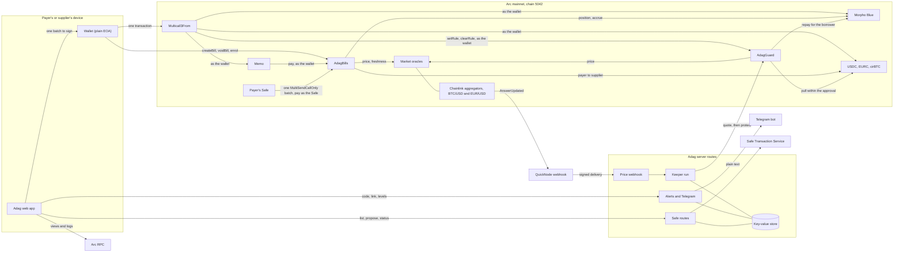
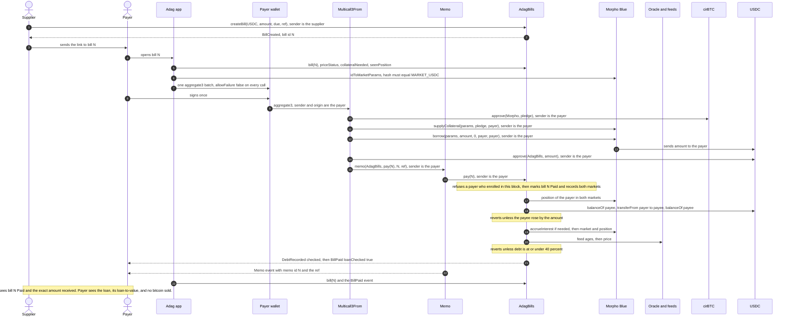
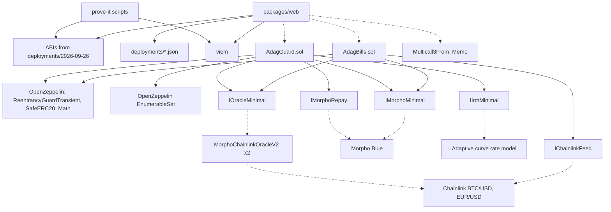

# Adag architecture and frontend interface

The one document the app is built from: what exists on chain, what the app and its server routes read, what they ask a wallet or a Safe to sign, and the rules they obey. Every address below is live on Arc mainnet (chain 5042). The security rules are cited by number from `docs/security/threat-model.md` section C, which runs from C1 to C60.

## 1. What Adag is

Adag is a bill book on Arc mainnet: a supplier writes a bill in USDC or EURC on chain, and anyone else can pay it exactly once. A payer who holds cirBTC can pay in one signature by pledging it on Morpho Blue and borrowing the bill amount, and Adag refuses the payment if that leaves the loan above 40% of the bitcoin's value (Morpho itself liquidates at 86%). A company can pay the same way from its Safe. A borrower whose loan was already open before they used Adag records it once with `enrol`, so Adag judges only what they borrow from then on.

After the payment, AdagGuard can look after the loan: the borrower sets a trigger and a target and approves an amount of the loan token, and once the loan passes the trigger anyone may call `protect`, which repays only what brings the loan back to the target, from the borrower's own wallet. A keeper run on Adag's server does that call when Chainlink's price updates, and Telegram alerts tell the borrower when a loan gets close and whenever the guard acts.

Both contracts are immutable, have no owner, never hold tokens between calls, and prove what they did in the same call that does it. The first AdagBills deployment (25 September 2026) stays live as history; its bills open at `/bill/first/N` and the app writes every new bill to the current one.

## 2. Diagrams

### 2a. System overview

Multicall3From and Memo reach their targets through Arc's CallFrom precompile, which is why the wallet, not the batch contract, is the sender Morpho, the tokens, AdagBills and AdagGuard see. A Safe cannot use them (CallFrom needs the sender to be the signer of the transaction), so a Safe calls AdagBills directly inside its own batch.

### 2b. One bitcoin-backed payment, end to end

### 2c. Contract and module dependencies

Solid arrows are code dependencies. Dotted arrows are calls to deployed contracts.

## 3. Deployed addresses (Arc mainnet, chain 5042)

Explorer: `https://explorer.arc.io`. Every address below is a build-time constant in the app (C3).

| What | Address | Link |
| --- | --- | --- |
| AdagBills, current | `0xaf6C47ae3e2ccD2Cd829Dd8a1DcCb7a7665c08cB` | [explorer](https://explorer.arc.io/address/0xaf6C47ae3e2ccD2Cd829Dd8a1DcCb7a7665c08cB) |
| AdagGuard | `0x9A3F3eE50Ae108124C7Cf54a1b68c14fe5800806` | [explorer](https://explorer.arc.io/address/0x9A3F3eE50Ae108124C7Cf54a1b68c14fe5800806) |
| AdagBills, first deployment (history) | `0x6F2199e0A04e5e8ba67c89C467b6DF168b01137E` | [explorer](https://explorer.arc.io/address/0x6F2199e0A04e5e8ba67c89C467b6DF168b01137E) |
| Multicall3From | `0x522fAf9A91c41c443c66765030741e4AaCe147D0` | [explorer](https://explorer.arc.io/address/0x522fAf9A91c41c443c66765030741e4AaCe147D0) |
| Memo | `0x5294E9927c3306DcBaDb03fe70b92e01cCede505` | [explorer](https://explorer.arc.io/address/0x5294E9927c3306DcBaDb03fe70b92e01cCede505) |
| CallFrom precompile (never called by the app) | `0x1800000000000000000000000000000000000003` | [explorer](https://explorer.arc.io/address/0x1800000000000000000000000000000000000003) |
| Multicall3, for batched reads only | `0xcA11bde05977b3631167028862bE2a173976CA11` | [explorer](https://explorer.arc.io/address/0xcA11bde05977b3631167028862bE2a173976CA11) |
| Morpho Blue | `0x34CD04070dD72b14E241112F6d83812Df5Af7fCD` | [explorer](https://explorer.arc.io/address/0x34CD04070dD72b14E241112F6d83812Df5Af7fCD) |
| USDC, ERC-20 face, 6 decimals | `0x3600000000000000000000000000000000000000` | [explorer](https://explorer.arc.io/address/0x3600000000000000000000000000000000000000) |
| EURC, 6 decimals | `0xbEf5f6d51CB62b58e6A8f77868681825C6fe21c1` | [explorer](https://explorer.arc.io/address/0xbEf5f6d51CB62b58e6A8f77868681825C6fe21c1) |
| cirBTC, 8 decimals | `0x171A4217b86A807A64eB94757Db6849fb4bDbAA0` | [explorer](https://explorer.arc.io/address/0x171A4217b86A807A64eB94757Db6849fb4bDbAA0) |
| Oracle, USDC market | `0x2AA87fF48933Ce6aBA240BEE916Fc2e6Ec1e51Ab` | [explorer](https://explorer.arc.io/address/0x2AA87fF48933Ce6aBA240BEE916Fc2e6Ec1e51Ab) |
| Oracle, EURC market | `0x6945246777DfdF4744D957323857F797Ec19Ca1e` | [explorer](https://explorer.arc.io/address/0x6945246777DfdF4744D957323857F797Ec19Ca1e) |
| Interest rate model (both markets) | `0xF02615d094Fc02fC031C35fe705e175aA4653f20` | [explorer](https://explorer.arc.io/address/0xF02615d094Fc02fC031C35fe705e175aA4653f20) |
| Chainlink BTC/USD, the proxy the oracles read | `0x7777547914e03BCbB04Ae034942765a0dbb26aE3` | [explorer](https://explorer.arc.io/address/0x7777547914e03BCbB04Ae034942765a0dbb26aE3) |
| Chainlink EUR/USD, the proxy the oracles read | `0xa4266689D107aF71c7dBE975cfB92aB40E7b4EFE` | [explorer](https://explorer.arc.io/address/0xa4266689D107aF71c7dBE975cfB92aB40E7b4EFE) |
| BTC/USD aggregator, emits `AnswerUpdated` | `0x733FE1bA02ea9003C3CFbf5dcc41cf685fF64362` | [explorer](https://explorer.arc.io/address/0x733FE1bA02ea9003C3CFbf5dcc41cf685fF64362) |
| EUR/USD aggregator, emits `AnswerUpdated` | `0xCEDbC96d866EBe46dcbeF8Ed12F9feA2C464d88F` | [explorer](https://explorer.arc.io/address/0xCEDbC96d866EBe46dcbeF8Ed12F9feA2C464d88F) |
| Safe MultiSendCallOnly v1.4.1 | `0x9641d764fc13c8B624c04430C7356C1C7C8102e2` | [explorer](https://explorer.arc.io/address/0x9641d764fc13c8B624c04430C7356C1C7C8102e2) |
| Safe SimulateTxAccessor v1.4.1 | `0x3d4BA2E0884aa488718476ca2FB8Efc291A46199` | [explorer](https://explorer.arc.io/address/0x3d4BA2E0884aa488718476ca2FB8Efc291A46199) |

| Morpho market | Id | Oracle | Liquidation line | Link |
| --- | --- | --- | --- | --- |
| MARKET_USDC (lends USDC against cirBTC) | `0xc2db905f174e5defcce01d321b09f15f78856a36a21b90cc7e1abbc29225815d` | `0x2AA8...51Ab` | 86% | [Morpho app](https://app.morpho.org/arc/market/0xc2db905f174e5defcce01d321b09f15f78856a36a21b90cc7e1abbc29225815d) |
| MARKET_EURC (lends EURC against cirBTC) | `0x6ea1ea96a1cc671615f3a3bdf51481c5b79e362a8b634396e680d1070137daf4` | `0x6945...Ca1e` | 86% | [Morpho app](https://app.morpho.org/arc/market/0x6ea1ea96a1cc671615f3a3bdf51481c5b79e362a8b634396e680d1070137daf4) |

A second, small USDC/cirBTC market exists (`0xabd1...b566`) with a different oracle. The app never uses it; the hash check in section 7 keeps it out, and both contracts refuse any other id.

Deployments, all solc 0.8.30, optimizer 200 runs, EVM prague, each verified with an exact match on Sourcify and on explorer.arc.io:

| Contract | Transaction | Block | Gas | Cost |
| --- | --- | --- | ---: | ---: |
| AdagBills, current | [0xad01...64b1](https://explorer.arc.io/tx/0xad01e84dfff670f8b63346d744c5690c14d07457f1ceeb23c43cfa51cdfc64b1) | 22,859,681 | 2,227,984 | 0.044560 USDC |
| AdagGuard | [0xa969...1e1c](https://explorer.arc.io/tx/0xa969222d5ec16e0481063d2f1426ae86c56414665b1ab27da880f04859291e1c) | 22,859,780 | 1,778,869 | 0.035577 USDC |
| AdagBills, first | [0x758e...6e50](https://explorer.arc.io/tx/0x758e4463ec738c675e4d9615aff67d9864359c7a30b3a77bd7b2689d30a66e50) | 22,727,688 | | |

The records: `packages/contracts/deployments/arc-mainnet.json` (key `AdagBillsEnrol` for the current AdagBills, `AdagBills` for the first), `adag-guard.arc-mainnet.json`, and the ABIs and Standard JSON inputs in `2026-09-26/` and `2026-09-25/`. The live proofs are in `prove-it-2026-09-26.md` (bill #1 on the current contract, and the enrol promise on a real borrower at 70.26%) and `guard-prove-2026-09-26.md` (the guard's first repayment, 39.07% to 30.00%).

RPC: `https://rpc.mainnet.arc.io`. The app reads everything it shows from Arc over this RPC, including the borrow rate. The server reads through the RPC set in `ARC_RPC_URL`.

## 4. The interface

The ABIs are `packages/contracts/deployments/2026-09-26/AdagBills.abi.json` and `AdagGuard.abi.json`. Amounts are integers in the token's base units: 6 decimals for USDC and EURC, 8 for cirBTC. Loan-to-value figures are WAD scaled, so `0.4e18` means 40%.

### AdagBills

`Status` is `0 None, 1 Open, 2 Paid, 3 Void`. `bill()` returns the tuple `(address payee, uint8 status, uint64 due, address currency, uint64 createdAt, uint256 amount, address payer, uint64 paidAt, bytes ref)`. Both deployments number bills from 1, so a bill is always the pair (contract, id) (C33).

| Signature | What it is for |
| --- | --- |
| `createBill(address currency, uint256 amount, uint64 due, bytes ref) returns (uint256 id)` | The caller writes a bill payable to themselves. `due` is information only, 0 for none. Ids start at 1. |
| `voidBill(uint256 id)` | The payee cancels an open bill. It can never be paid after that. |
| `pay(uint256 id)` | Pays an open bill from the caller's balance. From a wallet, always sent through Memo inside a Multicall3From batch; from a Safe, called directly inside the Safe's MultiSendCallOnly batch. Refused in the block the caller enrolled in. |
| `enrol()` | No arguments. Records the caller's own Morpho position in both markets, exactly as Morpho reports it in this block, and the block. Moves no tokens (C31). |
| `bill(uint256 id) view returns (Bill)` | The full record. An id never written returns status `None`. |
| `billCount() view returns (uint256)` | Bills ever written, which is also the highest id. |
| `billsOfPayee(address payee, uint256 offset, uint256 limit) view returns (uint256[] ids, uint256 total)` | A supplier's bills, oldest first. `limit` at most 100. |
| `paymentsOfPayer(address payer, uint256 offset, uint256 limit) view returns (uint256[] ids, uint256 total)` | Bills a payer has paid, oldest first. `limit` at most 100. |
| `seenPosition(address payer, bytes32 marketId) view returns (uint256 shares, uint256 collateral)` | The position Adag recorded at the payer's last payment or enrol. The next payment is checked if the payer has debt and more shares or less collateral than this. |
| `enrolledAt(address payer) view returns (uint64 blockNumber)` | The block the payer last enrolled in, or 0. |
| `loanToValue(address user, bytes32 marketId) view returns (uint256 ltvWad)` | Debt over collateral value, rounded up. A preview: no interest accrual, no freshness check. `type(uint256).max` means debt with no collateral value. |
| `collateralNeeded(address user, bytes32 marketId, uint256 extraBorrow) view returns (uint256 extraCollateral)` | Extra cirBTC, in satoshis, to pledge so current debt plus `extraBorrow` sits at or under 40%. 0 if none is needed. |
| `priceStatus(bytes32 marketId) view returns (bool fresh, uint256 btcUsdUpdatedAt, uint256 eurUsdUpdatedAt)` | Whether a payment that adds debt would pass the freshness check now. `eurUsdUpdatedAt` is 0 for the USDC market. |
| `MORPHO()`, `USDC()`, `EURC()`, `CIRBTC()`, `MARKET_USDC()`, `MARKET_EURC()`, `MAX_LTV_WAD()`, `BTC_USD_MAX_AGE()`, `EUR_USD_MAX_AGE()`, `MAX_REFERENCE_BYTES()`, `MAX_PAGE()` | The fixed values: the addresses and ids above, `0.4e18`, 26 hours, 96 hours, 140 bytes and 100 ids. |

| Event | What it is for |
| --- | --- |
| `BillCreated(uint256 indexed id, address indexed payee, address indexed currency, uint256 amount, uint64 due, bytes ref)` | A bill was written. The app reads the new id from it. |
| `BillVoided(uint256 indexed id, address indexed payee)` | A bill was cancelled. |
| `BillPaid(uint256 indexed id, address indexed payer, address indexed payee, address currency, uint256 amount, bool loanChecked)` | The proof of payment. `loanChecked` is true if the 40% check ran. |
| `DebtRecorded(address indexed payer, bytes32 indexed marketId, uint256 borrowShares, uint256 collateral, bool checked)` | Adag stored a new position for the payer in one market. `checked` says whether the 40% check ran for it. |
| `Enrolled(address indexed payer, uint256 usdcShares, uint256 usdcCollateral, uint256 eurcShares, uint256 eurcCollateral)` | A borrower recorded their existing position. The app proves an enrol by this event and a fresh `seenPosition` equal to Morpho's position. |

Through a wallet batch, Adag's error arrives wrapped as Memo's `MemoFailed(bytes returnData)`, and Multicall3From passes that up unchanged. Unwrap it before showing a reason. The plain wording to show is on the right.

| Error | Meaning, and what the app says |
| --- | --- |
| `ZeroAmount()` | The bill amount is 0. |
| `ReferenceTooLong(uint256 length)` | The reference is over 140 bytes. Count bytes, not characters. |
| `UnsupportedCurrency(address currency)` | Only USDC and EURC. |
| `UnknownBill(uint256 id)` | No bill with this number. |
| `BillNotOpen(uint256 id, uint8 status)` | Already paid or cancelled. |
| `NotPayee(address caller)` | Only the supplier who wrote the bill can cancel it. |
| `SelfPayment()` | You cannot pay your own bill. |
| `EnrolledThisBlock()` | You recorded your loan in this block. Pay from the next block on. |
| `PayeeNotCredited(uint256 rise, uint256 amount)` | The supplier's balance did not rise by the amount, so nothing happened. |
| `BadMarket(bytes32 marketId)` | Morpho reports the market differently from what Adag expects. Nothing can be paid from a loan until this is fixed. |
| `BadFeed(address oracle)` | The market's price oracle names no feed. |
| `StalePrice(address feed, uint256 updatedAt)` | The price feed is too old for a new loan. Paying from balance still works. |
| `ZeroPrice()` | The oracle reads 0. |
| `LtvAboveLimit(bytes32 marketId, uint256 borrowed, uint256 maxBorrow)` | This would leave the loan above 40%. Pledge more cirBTC or borrow less; for a loan that was open before Adag, record it first. |
| `PageTooLarge(uint256 limit)` | A page asked for more than 100 ids. |
| `ReentrancyGuardReentrantCall()`, `SafeERC20FailedOperation(address token)` | From OpenZeppelin: cannot happen in the app's flows, or the token transfer returned false. |

### AdagGuard

A rule is `(uint64 triggerWad, uint64 targetWad, uint64 expiry)`; `expiry` 0 means no end date. The borrower's approval of the loan token to AdagGuard is the lifetime ceiling: there is no per-step maximum and no cooldown, and each `protect` repays only what brings the loan back to the target (C36, C38).

| Signature | What it is for |
| --- | --- |
| `setRule(bytes32 marketId, uint64 triggerWad, uint64 targetWad, uint64 expiry)` | The caller's own rule. Refused unless the target is above 0 and below the trigger, the trigger is below Morpho's liquidation line, and the end date is in the future or 0 (C41). Adds the caller to the on-chain list of rule holders. |
| `clearRule(bytes32 marketId)` | Deletes the caller's rule; reads nothing from Morpho, so it always works. |
| `protect(address borrower, bytes32 marketId) returns (uint256 repaid)` | Anyone may call it. At or above the trigger and before the end date, it pulls from the borrower's wallet the least of: what brings the loan back to the target, the remaining approval, the wallet's balance and the debt rounded down, and repays exactly that to Morpho for the borrower. Otherwise it returns 0 and emits nothing. |
| `ruleOf(address borrower, bytes32 marketId) view returns (Rule)` | The rule, all zeros for none. |
| `quote(address borrower, bytes32 marketId) view returns (bool wouldAct, uint256 amount, uint256 ltvWad)` | The same computation `protect` runs, at the current block (C40). |
| `holderCount() view returns (uint256)`, `holders(uint256 offset, uint256 limit) view returns (address[])` | The rule holders, in pages of at most 100 (C43). |
| `MORPHO()`, `USDC()`, `EURC()`, `CIRBTC()`, `MARKET_USDC()`, `MARKET_EURC()`, `MAX_PAGE()` | The fixed values. |

| Event | What it is for |
| --- | --- |
| `RuleSet(address indexed borrower, bytes32 indexed marketId, uint64 triggerWad, uint64 targetWad, uint64 expiry)` | The proof a rule was saved, with its values. |
| `RuleCleared(address indexed borrower, bytes32 indexed marketId)` | The proof a rule was stopped. |
| `Protected(address indexed borrower, bytes32 indexed marketId, uint256 repaid, uint256 ltvBeforeWad, uint256 ltvAfterWad)` | The guard repaid part of a loan. |

| Error | Meaning |
| --- | --- |
| `BadMarket(bytes32 marketId)` | Not one of the two markets, or Morpho reports it differently. |
| `ZeroTarget()`, `TargetNotBelowTrigger(uint64, uint64)`, `TriggerNotBelowLiquidation(uint64, uint256)`, `ExpiryInPast(uint64)` | The rule is not valid; the app checks the same things before it builds (C41). |
| `NoRule(address borrower, bytes32 marketId)` | There is no rule to clear. |
| `RepaidNotPulled(uint256, uint256)`, `GuardBalanceChanged(uint256, uint256)`, `MorphoAllowanceLeft(uint256, uint256)` | The pull, the repayment and the guard's own balance and approval must all line up after the call, or nothing happens (C35). |
| `PageTooLarge(uint256 limit)` | A page asked for more than 100 holders. |

Morpho and the tokens revert with plain strings. The ones a payer can meet: `"insufficient collateral"` (past Morpho's own 86% line), `"insufficient liquidity"` (the market ran out of cash), `"zero assets"`, and a token blocklist or pause (`"Blacklistable: account is blacklisted"`, `"Pausable: paused"`, or Arc's `"Blocked address"`).

## 5. Reads the app makes, per screen

All reads are `eth_call` views over the RPC, or `eth_getLogs` where named. "Adag" means the current AdagBills unless a bill belongs to the first deployment, and `m` is the market of the bill's currency (`MARKET_USDC` for USDC, `MARKET_EURC` for EURC).

### Bill page (`/bill/{id}`, and `/bill/first/{id}` for the first deployment)

| Read | Contract | Why |
| --- | --- | --- |
| `bill(id)` | the bill's own AdagBills | Status, payee, currency, amount, due, ref, payer, paidAt. Status `None` means no such bill. While a bill is Open, it is read again every few seconds so the page turns Paid on its own. |
| `balanceOf(payer)` on USDC, EURC, cirBTC | tokens | Can the payer pay from balance, and how much cirBTC is free. |
| `idToMarketParams(m)` | Morpho | The market params that go into the batch. Hash-checked first (section 7). |
| `position(m, payer)` and `market(m)` for both markets | Morpho | Current pledge and debt. Debt is `ceil(borrowShares * (totalBorrowAssets + 1) / (totalBorrowShares + 1e6))`. |
| `seenPosition(payer, m)` for both markets, `enrolledAt(payer)` | Adag | Whether this payment will run the 40% check on debt the payer already had. A loan above 40% that Adag has never seen is refused even from cash, so the page offers to record it first (C32). |
| `price()` on the market's oracle | oracle | cirBTC value in the loan token, scaled 1e36. |
| `loanToValue(payer, m)` and `collateralNeeded(payer, m, bill.amount)` | Adag | The payer's loan-to-value now, and the pledge to propose before the margin in section 7. |
| `priceStatus(m)` | Adag | If `fresh` is false, say "New loans are paused until the price feed updates. Paying from your balance still works." and do not offer the bitcoin path. |
| `ruleOf(payer, m)`, `allowance(payer, AdagGuard)` and `quote(payer, m)` | AdagGuard, token | Whether this payment would trip the payer's own guard, and what the guard is about to take, which the pay screens keep aside from the balance the payment can use (C45, C58). |
| `BillPaid` logs, topic1 = `id` | the bill's own AdagBills, `eth_getLogs` | For a paid bill, the transaction that paid it (C16). Search a window around `paidAt`, in pages of at most 10,000 blocks. |

### Wallet page (`/app`)

| Read | Contract | Why |
| --- | --- | --- |
| `paymentsOfPayer` and `billsOfPayee`, then `bill(id)` for each, on both deployments | AdagBills | Bills paid and bills written, oldest first, and the CSV export. |
| `position(id, payer)` and `market(id)` for both markets, the rate model's `borrowRateView` | Morpho | Live pledge and debt in each market, accrued to the current block (C28). |
| `price()` on both oracles, `loanToValue` for both markets | oracles, Adag | Value of the pledge and loan-to-value in each market. |
| `seenPosition` and `enrolledAt` | Adag | Whether the loan needs recording before a payment. |
| `ruleOf`, `quote`, and the loan token's `allowance(payer, AdagGuard)` for each loan | AdagGuard, tokens | The guard summary on each loan card: the rule, what it would repay right now, and the standing approval beside it (C60). |

Liquidation distance at 86%, per market: Morpho can liquidate when debt passes `floor(collateral * price / 1e36) * 0.86`. The price at which that happens is `debt * 1e36 / (collateral * 0.86)`, and the fall that gets there is `1 - ltv / 0.86`. Interest raises the debt slowly over time, so show the figure as of now.

### Landing page (no wallet needed)

| Read | Where | Why |
| --- | --- | --- |
| `BillPaid` logs from each AdagBills since its deploy block | server, `eth_getLogs` in pages of at most 10,000 blocks, indexed in the key-value store | The paid totals and the newest payments, from each contract's own event only (C16). No bill reference is ever shown there. Without a store, the server reads the newest 400 bills of each contract directly and says so. |
| `market(MARKET_USDC)` and `market(MARKET_EURC)` | Morpho | Liquidity is `totalSupplyAssets - totalBorrowAssets`. |
| `priceStatus(MARKET_USDC)`, `MAX_LTV_WAD()`, `idToMarketParams(MARKET_USDC).lltv` | Adag, Morpho | "Bitcoin price live" or "paused", and the 40% and 86% lines, read rather than assumed. |
| `borrowRateView(idToMarketParams(MARKET_USDC), market(MARKET_USDC))` | Interest rate model | The live borrow rate, shown as a yearly figure. Display only, never in a transaction (C18). |
| `price()` on the USDC market's oracle | Oracle | Dollars per cirBTC (`price / 1e34`), for display only. |

### Alerts page (`/app/protect`)

Nothing about whether a wallet has alerts is read from the server: no route answers that question (C49). The page remembers only what this browser's own signer did.

## 6. Writes

### Signed by a wallet

Every batch is one `Multicall3From.aggregate3(Call3[])` sent from the payer's own wallet, with `allowFailure: false` on every call. Each call's target is a build-time constant, and its arguments come from the verified bill record, the verified market params and the payer's own address (C3). `params` is the market params tuple `(loanToken, collateralToken, oracle, irm, lltv)` for the market named. `payData(N)` is `abi.encodeCall(AdagBills.pay, (N))`, and `memoId(N)` is `N` as a 32-byte big-endian word.

**Create a bill.** A direct transaction from the supplier's wallet: `AdagBills.createBill(currency, amount, due, ref)`. The amount is parsed once from the typed decimal, the reference is the UTF-8 bytes of the text (at most 140 bytes), and the new id is read from the `BillCreated` event in the receipt, filtered by Adag's address.

**Pay from balance** (bill `N`, currency `C`, amount `A`, reference `R`):
1. `C.approve(AdagBills, A)`
2. `Memo.memo(AdagBills, payData(N), memoId(N), R)`

**Pay from bitcoin** (pledge `P`, see section 7 for the margin):
1. `cirBTC.approve(Morpho, P)`
2. `Morpho.supplyCollateral(params, P, payer, 0x)`
3. `Morpho.borrow(params, A, 0, payer, payer)`
4. `C.approve(AdagBills, A)`
5. `Memo.memo(AdagBills, payData(N), memoId(N), R)`

If `P` is 0 because the pledge already covers the loan, leave out steps 1 and 2, because Morpho refuses a zero pledge.

**Pay several bills in one signature.** Group by currency:
1. For each currency that needs a loan: `cirBTC.approve(Morpho, P_m)`, `Morpho.supplyCollateral(params_m, P_m, payer, 0x)`, `Morpho.borrow(params_m, A_m, 0, payer, payer)`. Here `A_m` is the sum of that currency's bills, and `P_m` comes from `collateralNeeded(payer, m, A_m)` plus the margin.
2. For each currency: `C.approve(AdagBills, sum of that currency's bills)`.
3. For each bill, in order: `Memo.memo(AdagBills, payData(N), memoId(N), R_N)`.

Every bill keeps its own memo, and one failure undoes the whole batch (C20). Duplicate ids are removed before building, since a repeat reverts the batch with `BillNotOpen`. A batch holds at most 10 bills: by extrapolating from the measured three-bill batch across two markets (828,382 gas), that is about 2.8M gas at most, under 10% of Arc's 30M block. The 10-bill figure has not been measured.

**Record an existing loan.** A direct transaction: `AdagBills.enrol()`. No money moves. Proven by the contract's own `Enrolled` for this wallet and a fresh `seenPosition` equal to Morpho's position in both markets.

**Void a bill.** A direct transaction: `AdagBills.voidBill(N)`.

**Close a loan** (market `m`, loan token `C`), built immediately before signing from a fresh read of `position(m, payer)` for shares `S` and collateral `K`, and the debt `D` accrued to this block:
1. `C.approve(Morpho, D + ceil(D / 1000))`
2. `Morpho.repay(params, 0, S, payer, 0x)`
3. `Morpho.withdrawCollateral(params, K, payer, payer)`
4. `C.approve(Morpho, 0)`

Repaying by the live share count is what leaves zero debt; repaying by assets leaves dust that blocks the withdrawal. The approval is reset to 0 in the same batch (C30). Closing a loan also stops its guard: the batch clears the rule and sets AdagGuard's approval to 0.

**Repay part of a loan:** `C.approve(Morpho, X)`, then `Morpho.repay(params, X, 0, payer, 0x)`, with `X` at most the debt rounded down. **Add collateral:** `cirBTC.approve(Morpho, X)`, then `Morpho.supplyCollateral(params, X, payer, 0x)`.

**Protect a loan** (loan token `C` of market `m`, approval `Q` exactly as typed):
1. `C.approve(AdagGuard, Q)`
2. `AdagGuard.setRule(m, trigger, target, expiry)`

**Stop protecting:** `AdagGuard.clearRule(m)` (when a rule exists), then `C.approve(AdagGuard, 0)`, in one batch (C60). These guard batches may reach only AdagGuard and the market's own loan token, approve only AdagGuard, and only for the amount given (C3 for this path).

### Signed by a Safe's owners

A Safe payment is one Safe transaction to `MultiSendCallOnly` by `delegatecall`, whose inner calls are plain calls with no value to build-time addresses only: the pledge and borrow on Morpho as the Safe, exact approvals to Morpho or AdagBills, and `AdagBills.pay(N)` for each bill, called directly (Memo and Multicall3From need an ordinary wallet). `gasPrice`, `gasToken`, `refundReceiver`, `safeTxGas` and `baseGas` are all 0, so any inner failure reverts the whole execution without spending the nonce (C51, C54). Before the owner signs, the app reads from the Safe itself that it is a Safe of version 1.3.0 or later, that the connected account is an owner, and the nonce, and simulates the batch as the Safe (C52). A Safe records its existing loan with `enrol()` as the only call of its own Safe transaction (C55). Safe payments are for bills on the current AdagBills.

### Server routes

| Route | What it does | Guarded by |
| --- | --- | --- |
| `GET or POST /api/keeper/run` | One keeper run: take the lease, read the next two pages of 100 rule holders from AdagGuard, drop any with no debt or no approval with two batched reads, `quote` the rest at one block, then simulate and send `protect` for at most five, riskiest first. At most 0.5 USDC of gas in any hour. Then send any alerts due. | `CRON_SECRET` as a bearer token; a lease so two runs never act at once (C42) |
| `POST /api/hooks/quicknode` | A price update from the two Chainlink aggregators wakes a run. | QuickNode's HMAC signature over the exact body, a five-minute window, and a replay key on the nonce (C44) |
| `POST /api/telegram` | Telegram's webhook: `/start <code>` and `/stop`. | Telegram's secret token header; each update handled once |
| `POST /api/alerts/code`, `/api/alerts/code/status` | A one-time code for the bot link, and which chat pressed Start, to whoever holds the code. | Per-client rate limits |
| `POST /api/alerts/link`, `/thresholds`, `/unlink` | Link a chat, set alert levels, stop alerts. | A message the wallet signs, naming the action, the site, chain 5042 and an expiry; nonces used once (C46, C47). A chat that already gets alerts for one wallet cannot be taken by another. |
| `GET /api/safe/list`, `/status`, `POST /api/safe/propose` | The owner's Safes, a proposal's signatures so far, and proposing a checked, signed batch to Safe's Transaction Service. | Per-client and overall rate limits; propose re-checks the shape, the Safe, the owner and the hash on chain before calling the service (C51, C52) |

The keeper's wallet holds gas only and can build exactly one call: `protect(borrower, market)` to AdagGuard with no value (C39). Every server key lives in server environment variables only (C56), and the server logs at start which features are off because a key is missing.

## 7. Rules the app must obey

The full list is `docs/security/threat-model.md` section C, C1 to C60, each naming where it is upheld. The ones every screen meets:

- **C3, what goes into a batch.** Targets are only the build-time constants in section 3. Approvals are exact and go only to the contract that uses them. Every `allowFailure` is false. Every `onBehalf` and `receiver` is the payer. From a link the app reads one thing, the bill id; everything else comes from `bill(id)`. Market params fetched from the RPC must hash to the fixed id before they are used: `keccak256(abi.encode(loanToken, collateralToken, oracle, irm, lltv)) == marketId`, and the oracle, rate model and 86% line must equal the constants.
- **C4, chain 5042 only.** No transaction is built and no signature is requested unless the wallet reports chain 5042.
- **C13, the pledge margin.** Propose `ceil(collateralNeeded(...) * 1.05)`. If the margin is not enough, the transaction reverts with `LtvAboveLimit`; it never over-borrows.
- **C14 and C15, what the payer sees.** References are plain text only, never HTML, markdown or a link. Payee and amount are decoded from the same record `pay` uses. Addresses are shown in full and checksummed.
- **C16 and C53, payment status.** Paid comes only from the bill's own AdagBills: `bill(id).status`, or a `BillPaid` event filtered by that contract's address, tied to its transaction hash and log index. Never from a Memo event or Safe's service.
- **C18 and C19, upstream data.** RPC and service values are for display and for proposing amounts, never an address, selector, chain id or receiver. Every fetch has a timeout and a size cap; a failed read shows "unavailable", never zero, unpaid or paid.
- **C24, fresh prices.** Offer the bitcoin path only when `priceStatus(m).fresh` is true.
- **C25 to C30.** Fee and principal come from one USDC balance; the funding choice is the payer's; no signature from any account but the one every check used; debt accrued to the current block; no approval above what the payer was shown; over-approvals reset in the same batch.
- **C31 to C33, recording a loan.** `enrol` writes only the caller's own record; a payment through Adag is never the action that takes a position above 40%; a bill is the pair (contract, id).
- **C34 to C45, the guard and the keeper.** The approval is the lifetime ceiling, typed by the borrower and never unlimited; the screen says so, and warns that a USDC rule can leave the wallet without gas; a rule that would act now is shown as "this will repay X within minutes" before the signature, and counted as an outflow by the pay screens.
- **C46 to C50, alerts.** Strict link binding, signed writes only, fixed text, a private link table, and alerts computed like the contract.
- **C51 to C55, Safe payments.** The transaction shape, checked on chain before signing, status from AdagBills only, atomic at execution, the Safe as the account throughout.
- **C56 to C60.** Secrets on the server only; bounded routes with fixed origins; a payment that trips the payer's own guard says so first; stopping the guard clears the rule and the approval together, and any rule shown has its approval beside it.
- **Ordinary wallets, or a Safe.** Arc's CallFrom only lets a batch act as the wallet that signed the transaction, so a wallet payment needs a plain EOA such as MetaMask or Rabby. ERC-4337 accounts and relayed transactions cannot pay; a Safe pays through its own path above. EIP-7702-delegated wallets can pay when they send their own transaction: tested on a mainnet fork (`packages/web/scripts/fork-7702.sh`).

## 8. Morpho's UI requirements

From Morpho's borrow guide, section "UX Requirements" (https://docs.morpho.org/developers/borrow/get-started#ux-requirements):

- **Attribution.** A "Powered by Morpho" mention in the interface, for example in the footer or near the borrow flow. Official logos: https://brand.morpho.org/.
- **Disclaimer.** Shown at least the first time a user interacts with Morpho through Adag, ideally with a checkbox before they proceed. The exact text, with the app name filled in:

> Accessing the Morpho Protocol through this app is governed by Adag's Terms of Use and [Morpho's Disclaimer](https://morpho.org/disclaimers/). By using it, you acknowledge that you have read and understood these terms and the risks involved.

The disclaimer names Adag's Terms of Use, so the app has a Terms of Use page for it to point to.

## 9. What each action costs

From `packages/contracts/analysis/GAS.md`: whole transactions, cold, measured on a mainnet fork. Arc charges fees in USDC; at the 20 gwei floor, 1,000,000 gas costs 0.02 USDC.

| Action | Gas | USDC at 20 gwei |
| --- | ---: | ---: |
| Write a bill, short reference, first bill ever | 196,734 | 0.0039 |
| Write a bill, short reference, later bill | 179,514 | 0.0036 |
| Write a bill, 140-byte reference | 310,756 | 0.0062 |
| Cancel a bill | 28,497 | 0.0006 |
| Record an existing loan once (enrol) | 84,923 | 0.0017 |
| Pay from balance | 189,024 | 0.0038 |
| Pay from bitcoin | 398,272 | 0.0080 |
| Three bills in one signature, two markets | 828,382 | 0.0166 |
| Close a loan in full | 154,599 | 0.0031 |
| Guard: set a first rule | 129,321 | 0.0026 |
| Guard: clear the last rule | 37,619 | 0.0008 |
| Guard: protect that repays | 180,235 | 0.0036 |
| Guard: protect that finds nothing to do | 109,521 | 0.0022 |

On mainnet, on 26 September: bill #1 on the current contract cost 196,806 gas (0.004133 USDC) to write and 394,110 gas (0.008276 USDC) to pay from bitcoin; the guard's rule and approval cost 180,883 gas (0.003799 USDC) and its first protect 211,485 gas (0.004441 USDC). The keeper reads `quote` for free before it sends anything, so a protect that would find nothing to do is never sent.

## 10. What the backend does not do

From the threat model's named non-goals:

- **It does not vouch for who a payee is.** A bill from someone pretending to be your landlord is a valid bill. Adag shows exactly who and how much.
- **It does not defend against Morpho, the oracles or the tokens being wrong,** paused, blocklisting or upgraded. It fails closed on their reverts and zeros.
- **It does not defend against a compromised wallet, browser or operating system, or a compromised page build or hosting.** A payer signing a batch cannot detect a compromised page.
- **It does not guarantee against liquidation.** The guard cannot act with no balance, no approval, or nobody calling `protect`; a single price jump past 86% outruns it; and interest can cross the trigger between price updates. Alerts are best effort and can never cause a transaction.
- **It does not stop a payer going above 40% by using Morpho directly.** The line applies to payments made through Adag. A batch that borrows after Adag's step is the named residual of the new-debt rule, and that payer's next Adag payment is checked. Recording a loan in block N and paying in block N+1 forgives the debt taken before the record, which is the named residual of `enrol`; both affect only the payer's own position.
- **It does not defend against a malicious Safe owner,** a compromised Telegram account or phone, or Safe's service, Telegram or the RPC provider being unavailable or dishonest.
- **It keeps nothing private that is on chain.** Every bill, amount, reference, payer, rule and protection is public.
- **It offers no front-running or MEV protection,** and needs none: its flows have no slippage to extract.
- **It does not control how third-party explorers render Memo data.**
- **It does not enforce due dates.** The due date is information only.
