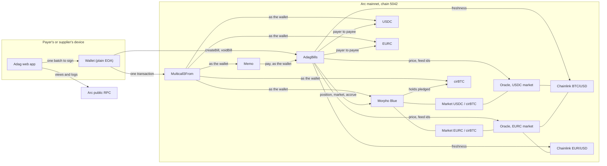
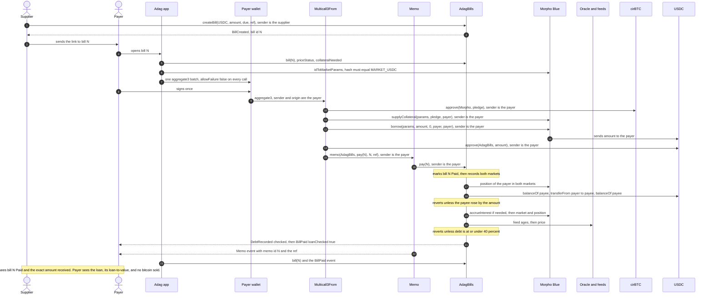
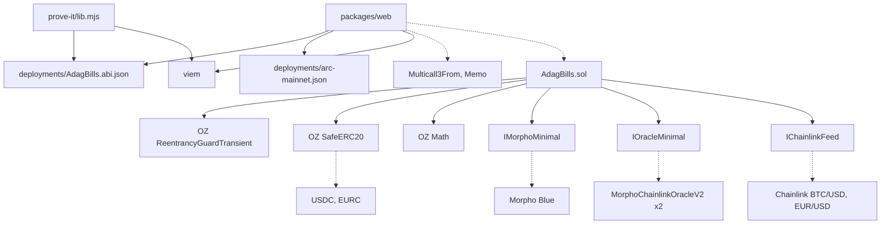

# Adag architecture and frontend interface

The one document the frontend is built from: what exists on chain, what the app reads, what it asks a wallet to sign, and the rules it must obey. Every address below is live on Arc mainnet (chain 5042). The security rules are cited by number from `docs/security/threat-model.md` section C.

## 1. What Adag is

Adag is a bill book on Arc mainnet: a supplier writes a bill in USDC or EURC on chain, and anyone else can pay it exactly once. A payer who holds cirBTC can pay in one signature by pledging it on Morpho Blue and borrowing the bill amount, and Adag refuses the payment if that leaves the loan above 40% of the bitcoin's value (Morpho itself liquidates at 86%). The contract is immutable, has no owner, never holds tokens, and proves the supplier was credited in the same call that marks the bill paid.

## 2. Diagrams

### 2a. System overview

Multicall3From and Memo reach their targets through Arc's CallFrom precompile, which is why the wallet, not the batch contract, is the sender Morpho, the tokens and AdagBills see.

### 2b. One bitcoin-backed payment, end to end

### 2c. Contract and module dependencies

Solid arrows are code dependencies. Dotted arrows are calls to deployed contracts.

## 3. Deployed addresses (Arc mainnet, chain 5042)

Explorer: `https://explorer.arc.io`. Every address below is a build-time constant in the app (C3).

| What | Address | Link |
| --- | --- | --- |
| AdagBills | `0x6F2199e0A04e5e8ba67c89C467b6DF168b01137E` | [explorer](https://explorer.arc.io/address/0x6F2199e0A04e5e8ba67c89C467b6DF168b01137E) |
| Multicall3From | `0x522fAf9A91c41c443c66765030741e4AaCe147D0` | [explorer](https://explorer.arc.io/address/0x522fAf9A91c41c443c66765030741e4AaCe147D0) |
| Memo | `0x5294E9927c3306DcBaDb03fe70b92e01cCede505` | [explorer](https://explorer.arc.io/address/0x5294E9927c3306DcBaDb03fe70b92e01cCede505) |
| CallFrom precompile (never called by the app) | `0x1800000000000000000000000000000000000003` | [explorer](https://explorer.arc.io/address/0x1800000000000000000000000000000000000003) |
| Morpho Blue | `0x34CD04070dD72b14E241112F6d83812Df5Af7fCD` | [explorer](https://explorer.arc.io/address/0x34CD04070dD72b14E241112F6d83812Df5Af7fCD) |
| USDC, ERC-20 face, 6 decimals | `0x3600000000000000000000000000000000000000` | [explorer](https://explorer.arc.io/address/0x3600000000000000000000000000000000000000) |
| EURC, 6 decimals | `0xbEf5f6d51CB62b58e6A8f77868681825C6fe21c1` | [explorer](https://explorer.arc.io/address/0xbEf5f6d51CB62b58e6A8f77868681825C6fe21c1) |
| cirBTC, 8 decimals | `0x171A4217b86A807A64eB94757Db6849fb4bDbAA0` | [explorer](https://explorer.arc.io/address/0x171A4217b86A807A64eB94757Db6849fb4bDbAA0) |
| Oracle, USDC market | `0x2AA87fF48933Ce6aBA240BEE916Fc2e6Ec1e51Ab` | [explorer](https://explorer.arc.io/address/0x2AA87fF48933Ce6aBA240BEE916Fc2e6Ec1e51Ab) |
| Oracle, EURC market | `0x6945246777DfdF4744D957323857F797Ec19Ca1e` | [explorer](https://explorer.arc.io/address/0x6945246777DfdF4744D957323857F797Ec19Ca1e) |
| Interest rate model (both markets) | `0xF02615d094Fc02fC031C35fe705e175aA4653f20` | [explorer](https://explorer.arc.io/address/0xF02615d094Fc02fC031C35fe705e175aA4653f20) |
| Chainlink BTC/USD | `0x7777547914e03BCbB04Ae034942765a0dbb26aE3` | [explorer](https://explorer.arc.io/address/0x7777547914e03BCbB04Ae034942765a0dbb26aE3) |
| Chainlink EUR/USD | `0xa4266689D107aF71c7dBE975cfB92aB40E7b4EFE` | [explorer](https://explorer.arc.io/address/0xa4266689D107aF71c7dBE975cfB92aB40E7b4EFE) |

| Morpho market | Id | Oracle | Liquidation line | Link |
| --- | --- | --- | --- | --- |
| MARKET_USDC (lends USDC against cirBTC) | `0xc2db905f174e5defcce01d321b09f15f78856a36a21b90cc7e1abbc29225815d` | `0x2AA8...51Ab` | 86% | [Morpho app](https://app.morpho.org/arc/market/0xc2db905f174e5defcce01d321b09f15f78856a36a21b90cc7e1abbc29225815d) |
| MARKET_EURC (lends EURC against cirBTC) | `0x6ea1ea96a1cc671615f3a3bdf51481c5b79e362a8b634396e680d1070137daf4` | `0x6945...Ca1e` | 86% | [Morpho app](https://app.morpho.org/arc/market/0x6ea1ea96a1cc671615f3a3bdf51481c5b79e362a8b634396e680d1070137daf4) |

A second, small USDC/cirBTC market exists (`0xabd1...b566`) with a different oracle. The app never uses it; the hash check in section 7 is what keeps it out.

Deployment: transaction [0x758e...6e50](https://explorer.arc.io/tx/0x758e4463ec738c675e4d9615aff67d9864359c7a30b3a77bd7b2689d30a66e50), block 22,727,688, solc 0.8.30, optimizer 200 runs, EVM prague. Source verified with an exact match on Sourcify and on explorer.arc.io. The first live payment (bill 1, paid from a cirBTC-backed loan) is recorded in `packages/contracts/deployments/prove-it-2026-09-25.md`.

RPC: `https://rpc.mainnet.arc.io`. The app reads everything it shows from Arc over this RPC, including the borrow rate.

## 4. The interface

The ABI is `packages/contracts/deployments/AdagBills.abi.json`, exported from the compiled artifact. Amounts are integers in the token's base units: 6 decimals for USDC and EURC, 8 for cirBTC. Loan-to-value figures are WAD scaled, so `0.4e18` means 40%.

`Status` is `0 None, 1 Open, 2 Paid, 3 Void`. `bill()` returns the tuple `(address payee, uint8 status, uint64 due, address currency, uint64 createdAt, uint256 amount, address payer, uint64 paidAt, bytes ref)`.

### Functions

| Signature | What it is for |
| --- | --- |
| `createBill(address currency, uint256 amount, uint64 due, bytes ref) returns (uint256 id)` | The caller writes a bill payable to themselves. `due` is information only, 0 for none. Ids start at 1. |
| `voidBill(uint256 id)` | The payee cancels an open bill. It can never be paid after that. |
| `pay(uint256 id)` | Pays an open bill from the caller's balance. Always sent through Memo inside a Multicall3From batch. |
| `bill(uint256 id) view returns (Bill)` | The full record. An id never written returns status `None`. |
| `billCount() view returns (uint256)` | Bills ever written, which is also the highest id. |
| `billsOfPayee(address payee, uint256 offset, uint256 limit) view returns (uint256[] ids, uint256 total)` | A supplier's bills, oldest first. `limit` at most 100. |
| `paymentsOfPayer(address payer, uint256 offset, uint256 limit) view returns (uint256[] ids, uint256 total)` | Bills a payer has paid, oldest first. `limit` at most 100. |
| `seenPosition(address payer, bytes32 marketId) view returns (uint256 shares, uint256 collateral)` | The position Adag recorded at the payer's last payment. The next payment is checked if the payer has debt and more shares or less collateral than this. |
| `loanToValue(address user, bytes32 marketId) view returns (uint256 ltvWad)` | Debt over collateral value, rounded up. A preview: no interest accrual, no freshness check. `type(uint256).max` means debt with no collateral value. |
| `collateralNeeded(address user, bytes32 marketId, uint256 extraBorrow) view returns (uint256 extraCollateral)` | Extra cirBTC, in satoshis, to pledge so current debt plus `extraBorrow` sits at or under 40%. 0 if none is needed. |
| `priceStatus(bytes32 marketId) view returns (bool fresh, uint256 btcUsdUpdatedAt, uint256 eurUsdUpdatedAt)` | Whether a payment that adds debt would pass the freshness check now. `eurUsdUpdatedAt` is 0 for the USDC market. |
| `MORPHO()`, `USDC()`, `EURC()`, `CIRBTC()` `view returns (address)` | The fixed addresses above. |
| `MARKET_USDC()`, `MARKET_EURC()` `view returns (bytes32)` | The fixed market ids above. |
| `MAX_LTV_WAD()` `view returns (uint256)` | `0.4e18`, the 40% line. |
| `BTC_USD_MAX_AGE()`, `EUR_USD_MAX_AGE()` `view returns (uint256)` | 26 hours and 96 hours, the oldest price a payment that adds debt accepts. |
| `MAX_REFERENCE_BYTES()`, `MAX_PAGE()` `view returns (uint256)` | 140 bytes and 100 ids. |

### Events

| Signature | What it is for |
| --- | --- |
| `BillCreated(uint256 indexed id, address indexed payee, address indexed currency, uint256 amount, uint64 due, bytes ref)` | A bill was written. The app reads the new id from it. |
| `BillVoided(uint256 indexed id, address indexed payee)` | A bill was cancelled. |
| `BillPaid(uint256 indexed id, address indexed payer, address indexed payee, address currency, uint256 amount, bool loanChecked)` | The proof of payment. `loanChecked` is true if the 40% check ran. |
| `DebtRecorded(address indexed payer, bytes32 indexed marketId, uint256 borrowShares, uint256 collateral, bool checked)` | Adag stored a new position for the payer in one market. `checked` says whether the 40% check ran for it. |

### Errors

Through a batch, Adag's error arrives wrapped as Memo's `MemoFailed(bytes returnData)`, and Multicall3From passes that up unchanged. Unwrap it before showing a reason. The plain wording to show is on the right.

| Signature | Meaning, and what the app says |
| --- | --- |
| `ZeroAmount()` | The bill amount is 0. |
| `ReferenceTooLong(uint256 length)` | The reference is over 140 bytes. Count bytes, not characters. |
| `UnsupportedCurrency(address currency)` | Only USDC and EURC. |
| `UnknownBill(uint256 id)` | No bill with this number. |
| `BillNotOpen(uint256 id, uint8 status)` | Already paid or cancelled. |
| `NotPayee(address caller)` | Only the supplier who wrote the bill can cancel it. |
| `SelfPayment()` | You cannot pay your own bill. |
| `PayeeNotCredited(uint256 rise, uint256 amount)` | The supplier's balance did not rise by the amount, so nothing happened. |
| `BadMarket(bytes32 marketId)` | Morpho reports the market differently from what Adag expects. Nothing can be paid from a loan until this is fixed. |
| `BadFeed(address oracle)` | The market's price oracle names no feed. |
| `StalePrice(address feed, uint256 updatedAt)` | The price feed is too old for a new loan. Paying from balance still works. |
| `ZeroPrice()` | The oracle reads 0. |
| `LtvAboveLimit(bytes32 marketId, uint256 borrowed, uint256 maxBorrow)` | This would leave the loan above 40%. Pledge more cirBTC or borrow less. |
| `PageTooLarge(uint256 limit)` | A page asked for more than 100 ids. |
| `ReentrancyGuardReentrantCall()` | From OpenZeppelin. Cannot happen in the app's flows. |
| `SafeERC20FailedOperation(address token)` | From OpenZeppelin: the token transfer returned false. |

Morpho and the tokens revert with plain strings. The ones a payer can meet: `"insufficient collateral"` (past Morpho's own 86% line), `"insufficient liquidity"` (the market ran out of cash), `"zero assets"`, and a token blocklist or pause (`"Blacklistable: account is blacklisted"`, `"Pausable: paused"`, or Arc's `"Blocked address"`).

## 5. Reads the app makes, per screen

All reads are `eth_call` views over the public RPC, or `eth_getLogs` where named. "Adag" means AdagBills, and `m` is the market of the bill's currency (`MARKET_USDC` for USDC, `MARKET_EURC` for EURC).

### Bill page (`/bill/{id}`)

| Read | Contract | Why |
| --- | --- | --- |
| `bill(id)` | Adag | Status, payee, currency, amount, due, ref, payer, paidAt. Status `None` means no such bill. |
| `balanceOf(payer)` on USDC, EURC, cirBTC | tokens | Can the payer pay from balance, and how much cirBTC is free. |
| `idToMarketParams(m)` | Morpho | The market params that go into the batch. Hash-checked first (section 7). |
| `position(m, payer)` and `market(m)` | Morpho | Current pledge and debt. Debt is `ceil(borrowShares * (totalBorrowAssets + 1) / (totalBorrowShares + 1e6))`. |
| `price()` on the market's oracle | oracle | cirBTC value in the loan token, scaled 1e36. For display. |
| `loanToValue(payer, m)` | Adag | The payer's loan-to-value now. |
| `collateralNeeded(payer, m, bill.amount)` | Adag | The pledge to propose, before the margin in section 7. |
| `priceStatus(m)` | Adag | If `fresh` is false, say "New loans are paused until the price feed updates. Paying from your balance still works." and do not offer the bitcoin path. |
| `seenPosition(payer, m)` | Adag | Optional: shows whether this payment will run the 40% check. |
| `BillPaid` logs, topic1 = `id` | Adag, `eth_getLogs` | For a paid bill, the transaction that paid it (C16). Search a window around `paidAt`, in pages of at most 10,000 blocks. |

### Payer dashboard

| Read | Contract | Why |
| --- | --- | --- |
| `paymentsOfPayer(payer, offset, 100)`, then `bill(id)` for each | Adag | Bills paid, oldest first. |
| `seenPosition(payer, MARKET_USDC)` and `(payer, MARKET_EURC)` | Adag | The positions Adag last accepted. |
| `position(id, payer)` and `market(id)` for both markets | Morpho | Live pledge and debt in each market. |
| `price()` on both oracles | oracles | Value of the pledge. |
| `loanToValue(payer, MARKET_USDC)` and `(payer, MARKET_EURC)` | Adag | Loan-to-value in each market. |

Liquidation distance at 86%, per market: Morpho can liquidate when debt passes `floor(collateral * price / 1e36) * 0.86`. The price at which that happens is `debt * 1e36 / (collateral * 0.86)`, and the fall that gets there is `1 - ltv / 0.86`. At 38% that is a 55.8% drop in BTC. Interest raises the debt slowly over time, so show the figure as of now.

### Payee dashboard

| Read | Contract | Why |
| --- | --- | --- |
| `billsOfPayee(payee, offset, 100)`, then `bill(id)` for each | Adag | Every bill the supplier wrote, with its status and who paid it. |

### Landing page (no wallet needed)

| Read | Contract | Why |
| --- | --- | --- |
| `billCount()` | Adag | Bills written. |
| `bill(id)` for `id` 1 to `billCount`, summing `amount` where status is Paid, per currency | Adag | Total paid, from Adag's own storage (C16). Read in bounded parallel chunks. Past a few hundred bills, switch to summing `BillPaid` logs from block 22,727,688, in pages of at most 10,000 blocks with a page cap, cached server-side. |
| `market(MARKET_USDC)` and `market(MARKET_EURC)` | Morpho | Liquidity is `totalSupplyAssets - totalBorrowAssets`. |
| `priceStatus(MARKET_USDC)` | Adag | "Bitcoin price live" or "paused". |
| `borrowRateView(idToMarketParams(MARKET_USDC), market(MARKET_USDC))` | Interest rate model | The live borrow rate, per second, shown as a yearly figure. Display only, never in a transaction (C18). The market params are hash-checked first (section 7). |
| `price()` on the USDC market's oracle | Oracle | Dollars per cirBTC (`price / 1e34`), for display only. |
| `MAX_LTV_WAD()`, and `idToMarketParams(MARKET_USDC).lltv` | Adag, Morpho | The 40% line and Morpho's 86% line, read rather than assumed. |

## 6. Writes the app makes

Every batch is one `Multicall3From.aggregate3(Call3[])` sent from the payer's own wallet, with `allowFailure: false` on every call. Each call's target is a build-time constant, and its arguments come from the verified bill record, the verified market params and the payer's own address (C3). `params` is the market params tuple `(loanToken, collateralToken, oracle, irm, lltv)` for the market named. `payData(N)` is `abi.encodeCall(AdagBills.pay, (N))`, and `memoId(N)` is `N` as a 32-byte big-endian word.

**Create a bill.** This is a direct transaction from the supplier's wallet, not a batch: `AdagBills.createBill(currency, amount, due, ref)`. The amount is parsed once from the typed decimal, the reference is the UTF-8 bytes of the text (at most 140 bytes), and the new id is read from the `BillCreated` event in the receipt, filtered by Adag's address.

**Pay from balance** (bill `N`, currency `C`, amount `A`, reference `R`):
1. `C.approve(AdagBills, A)`
2. `Memo.memo(AdagBills, payData(N), memoId(N), R)`

**Pay from bitcoin** (pledge `P`, see section 7 for the margin):
1. `cirBTC.approve(Morpho, P)`
2. `Morpho.supplyCollateral(params, P, payer, 0x)`
3. `Morpho.borrow(params, A, 0, payer, payer)`
4. `C.approve(AdagBills, A)`
5. `Memo.memo(AdagBills, payData(N), memoId(N), R)`

If `P` is 0 because the pledge already covers the loan, leave out steps 1 and 2, because Morpho refuses a zero pledge. This is the batch the live proof ran.

**Pay several bills in one signature.** Group by currency:
1. For each currency that needs a loan: `cirBTC.approve(Morpho, P_m)`, `Morpho.supplyCollateral(params_m, P_m, payer, 0x)`, `Morpho.borrow(params_m, A_m, 0, payer, payer)`. Here `A_m` is the sum of that currency's bills, and `P_m` comes from `collateralNeeded(payer, m, A_m)` plus the margin.
2. For each currency: `C.approve(AdagBills, sum of that currency's bills)`.
3. For each bill, in order: `Memo.memo(AdagBills, payData(N), memoId(N), R_N)`.

Every bill keeps its own memo, and one failure undoes the whole batch (C20). Remove duplicate ids before building, since a repeat reverts the batch with `BillNotOpen`.

The cap: the costliest single payment measured is a bitcoin-backed one at 396,047 gas, so even at that price per bill 75 bills fit in Arc's 30M block. The app caps a batch at 10 bills. By extrapolating from the measured three-bill batch across two markets (825,707 gas), that is an estimated 2M gas at most, under 7% of a block, and it keeps the wallet's review screen readable. The 10-bill figure has not been measured.

**Void a bill.** A direct transaction from the supplier's wallet: `AdagBills.voidBill(N)`.

**Close a loan** (market `m`, loan token `C`). Build it immediately before signing: read `position(m, payer)` for shares `S` and collateral `K`, and `market(m)` for the debt `D = ceil(S * (totalBorrowAssets + 1) / (totalBorrowShares + 1e6))`.
1. `C.approve(Morpho, D + ceil(D / 1000))`
2. `Morpho.repay(params, 0, S, payer, 0x)`
3. `Morpho.withdrawCollateral(params, K, payer, payer)`
4. `C.approve(Morpho, 0)`

Repaying by the live share count is what leaves zero debt; repaying by assets leaves dust that blocks the withdrawal. The 0.1% covers interest accrued since the read. The payer needs the loan token in their wallet, because the borrowed money went to the supplier. Tested after 1 hour and after 30 days.

**Add collateral** (amount `X` in satoshis):
1. `cirBTC.approve(Morpho, X)`
2. `Morpho.supplyCollateral(params, X, payer, 0x)`

Adag records the larger pledge at the payer's next payment without a check.

## 7. Rules the app must obey

From `docs/security/threat-model.md` section C.

- **C3, what goes into a batch.** Targets are only the build-time constants in section 3: AdagBills, Morpho, Memo, Multicall3From and the three tokens. Approvals go only to Morpho or AdagBills, for exactly the amount that batch uses. Every `allowFailure` is false. Every `onBehalf` and `receiver` is the payer. From a link the app reads one thing, the bill id; everything else comes from `bill(id)`. Market params fetched from the RPC must hash to the fixed id before they are used: `keccak256(abi.encode(loanToken, collateralToken, oracle, irm, lltv)) == marketId`. Also compare the oracle, rate model and 86% line to the constants in section 3, as `prove-it/lib.mjs` does (`verifyMarketParams`, `assertUsdcMarketConstants`).
- **C4, chain 5042 only.** No transaction is built and no signature is requested unless the wallet reports chain 5042. Check again right before each signature.
- **C13, the pledge margin.** Propose `ceil(collateralNeeded(...) * 1.05)`, the 5% margin prove-it used on mainnet. The fuzz tests bound Morpho's share rounding at 1 to 2 base units of debt (one satoshi covers that). Interest accrued between the read and the block adds a little more: at today's rates it is under a millionth of the debt per hour. The rest of the 5% absorbs a price move before the transaction lands. If the margin is not enough, the transaction reverts with `LtvAboveLimit`; it never over-borrows.
- **C14, the reference.** Show it as plain text only. Never render it as HTML, markdown or a link. Strip or escape bidirectional control characters, and show invalid UTF-8 as replacement characters.
- **C15, what the payer sees.** Payee and amount on the bill page are decoded from `bill(id)`, the same record `pay` uses. Amounts stay integers in base units and are only formatted for display. Addresses are shown in full and checksummed.
- **C16, payment status.** Paid or unpaid comes only from `bill(id).status` or a `BillPaid` event filtered by Adag's address and event signature, tied to its transaction hash and log index. A Memo event proves nothing: anyone can emit one with any id.
- **C18, upstream data.** RPC, GraphQL and indexer values are for display and for proposing a pledge. None is ever placed into a transaction as an address, selector, chain id or receiver.
- **C19, fetch limits.** Every fetch has an explicit timeout and a response size cap. Log queries stay within the RPC's 10,000-block window, with a bounded number of pages. A failed or malformed answer shows as "unavailable", never as zero, unpaid or paid.
- **Ordinary wallets only.** Arc's CallFrom only lets a batch act as the wallet that signed the transaction, so Memo and Multicall3From work only for plain EOAs such as MetaMask or Rabby. Smart-account wallets (Safe, ERC-4337 accounts, Circle's smart wallets) cannot pay through Adag, and sponsored or relayed transactions fail too. Check `getCode(wallet)`: if there is code, say plainly that this wallet type cannot pay here. EIP-7702-delegated wallets have code, but they can pay when they send their own transaction: tested on a mainnet fork (`packages/web/scripts/fork-7702.sh`).
- **C24, fresh prices.** Offer the bitcoin path only when `priceStatus(m).fresh` is true.
- **C25, fee and principal from one balance.** Before any signature, the payer's USDC covers every USDC the batch moves out plus the worst-case fee, since Arc takes gas from the same balance (`simulateAndSend`, `lib/wallet/send.ts`).
- **C26, consent to the funding source.** Balance or loan is the payer's choice and the app never substitutes it; a choice that becomes invalid is cleared, not replaced (the funding-choice effect in `components/app/Basket.tsx`).
- **C27, signer identity.** No signature unless the connected account is the one every onBehalf, receiver and balance check used (`simulateAndSend`, `lib/wallet/send.ts`).
- **C28, interest accrual on repay.** Every debt figure shown or approved is accrued to the current block from the rate and lastUpdate, with a margin only for the seconds before the block (`accrueBorrowAssets`, `closeApproval`, `lib/pay/loan.ts`).
- **C29, the displayed amount bounds the approval.** No approval exceeds what the payer was shown, so a wrong upstream answer can only cause a revert (the builders in `lib/pay/build.ts`).
- **C30, over-approval reset.** An approval above the amount used is reset to zero in the same batch, so none outlives it (`buildCloseLoan`, `lib/pay/build.ts`, ends with approve 0).

## 8. Morpho's UI requirements

From Morpho's borrow guide, section "UX Requirements" (https://docs.morpho.org/developers/borrow/get-started#ux-requirements):

- **Attribution.** A "Powered by Morpho" mention in the interface, for example in the footer or near the borrow flow. Official logos: https://brand.morpho.org/.
- **Disclaimer.** Shown at least the first time a user interacts with Morpho through Adag, ideally with a checkbox before they proceed. The exact text, with the app name filled in:

> Accessing the Morpho Protocol through this app is governed by Adag's Terms of Use and [Morpho's Disclaimer](https://morpho.org/disclaimers/). By using it, you acknowledge that you have read and understood these terms and the risks involved.

The disclaimer names Adag's Terms of Use, so the app needs a Terms of Use page for it to point to.

## 9. What each action costs

From `packages/contracts/analysis/GAS.md`: whole transactions, cold, measured on a mainnet fork. Arc charges fees in USDC; at the 20 gwei floor, 1,000,000 gas costs 0.02 USDC.

| Action | Gas | USDC at 20 gwei |
| --- | ---: | ---: |
| Write a bill, short reference, first bill ever | 196,662 | 0.0039 |
| Write a bill, short reference, later bill | 179,442 | 0.0036 |
| Write a bill, 140-byte reference | 310,684 | 0.0062 |
| Cancel a bill | 28,497 | 0.0006 |
| Pay from balance | 186,799 | 0.0037 |
| Pay from bitcoin | 396,047 | 0.0079 |
| Three bills in one signature, two markets | 825,707 | 0.0165 |
| Close a loan in full | 154,599 | 0.0031 |

On mainnet the live proof's bill cost 196,734 gas (0.004131 USDC) and its bitcoin-backed payment 406,167 gas (0.008530 USDC).

## 10. What the backend does not do

From the threat model's named non-goals:

- **It does not vouch for who a payee is.** A bill from someone pretending to be your landlord is a valid bill. Adag shows exactly who and how much.
- **It does not defend against Morpho, the oracles or the tokens being wrong,** paused, blocklisting or upgraded. It fails closed on their reverts and zeros.
- **It does not defend against a compromised wallet, browser or operating system.**
- **It does not defend against a compromised page build or hosting.** A payer signing a Multicall3From batch cannot detect one.
- **It does not watch a position after payment.** It checks the 40% line once, at payment. Interest and price keep moving, and Morpho liquidates at 86%.
- **It does not stop a payer going above 40% by using Morpho directly.** The line applies to payments made through Adag. A batch that borrows after Adag's step is the named residual, and that payer's next Adag payment is checked.
- **It keeps nothing private.** Every bill, amount, reference and payer is public.
- **It offers no front-running or MEV protection,** and needs none: its flows have no slippage to extract.
- **It does not keep the public RPC or the hosting available.**
- **It does not control how third-party explorers render Memo data.**
- **It does not enforce due dates.** The due date is information only.
