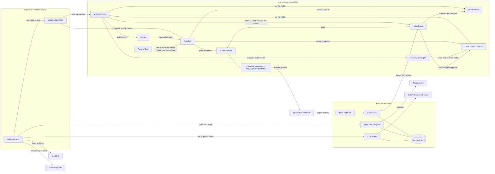
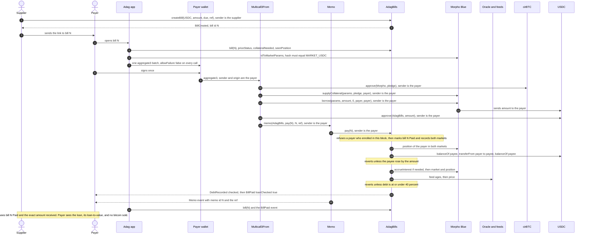
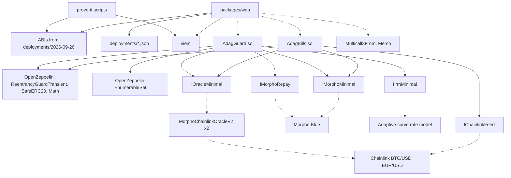

<p align="center">
  
</p>

<h1 align="center">Adag</h1>

<p align="center"><strong>Pay your bills with your bitcoin, without selling it.</strong></p>

<p align="center">Adag, from the Tamil அடகு, <em>adagu</em>, a pledge: the way families pledge gold for cash instead of selling it.</p>

<p align="center">
  <a href="https://adag.site">Live app</a> ·
  <a href="https://adag.site/docs">Docs</a> ·
  <a href="https://adag.site/break">Try to break it</a> ·
  <a href="https://explorer.arc.io/address/0xaf6C47ae3e2ccD2Cd829Dd8a1DcCb7a7665c08cB">Contract on explorer.arc.io</a>
</p>

Judges: start with [The two-minute judge path](#the-two-minute-judge-path).

## Live deployment

Three contracts are live on Arc mainnet (chain `5042`). Each is an exact source match on Sourcify and on explorer.arc.io, and each was compiled with solc 0.8.30, optimizer 200 runs, EVM prague.

| Contract | Address | Deployed |
| --- | --- | --- |
| **AdagBills**, the bill book the app uses | [`0xaf6C47ae3e2ccD2Cd829Dd8a1DcCb7a7665c08cB`](https://explorer.arc.io/address/0xaf6C47ae3e2ccD2Cd829Dd8a1DcCb7a7665c08cB) ([Sourcify](https://repo.sourcify.dev/5042/0xaf6C47ae3e2ccD2Cd829Dd8a1DcCb7a7665c08cB), [source](https://explorer.arc.io/address/0xaf6C47ae3e2ccD2Cd829Dd8a1DcCb7a7665c08cB?tab=contract)) | [`0xad01e84d...cdfc64b1`](https://explorer.arc.io/tx/0xad01e84dfff670f8b63346d744c5690c14d07457f1ceeb23c43cfa51cdfc64b1), block 22,859,681, 26 September 2026, 2,227,984 gas, 0.044560 USDC |
| **AdagGuard**, the loan guard | [`0x9A3F3eE50Ae108124C7Cf54a1b68c14fe5800806`](https://explorer.arc.io/address/0x9A3F3eE50Ae108124C7Cf54a1b68c14fe5800806) ([Sourcify](https://repo.sourcify.dev/5042/0x9A3F3eE50Ae108124C7Cf54a1b68c14fe5800806), [source](https://explorer.arc.io/address/0x9A3F3eE50Ae108124C7Cf54a1b68c14fe5800806?tab=contract)) | [`0xa969222d...59291e1c`](https://explorer.arc.io/tx/0xa969222d5ec16e0481063d2f1426ae86c56414665b1ab27da880f04859291e1c), block 22,859,780, 26 September 2026, 1,778,869 gas, 0.035577 USDC |
| AdagBills, first deployment, kept as history | [`0x6F2199e0A04e5e8ba67c89C467b6DF168b01137E`](https://explorer.arc.io/address/0x6F2199e0A04e5e8ba67c89C467b6DF168b01137E) ([Sourcify](https://repo.sourcify.dev/5042/0x6F2199e0A04e5e8ba67c89C467b6DF168b01137E)) | [`0x758e4463...0a66e50`](https://explorer.arc.io/tx/0x758e4463ec738c675e4d9615aff67d9864359c7a30b3a77bd7b2689d30a66e50), block 22,727,688, 25 September 2026 |

The first deployment has no way to record an existing loan. It stays live and immutable, and its bills still open at `/bill/first/N`; the app writes every new bill to the current AdagBills.

| Live proof | Transactions | Record |
| --- | --- | --- |
| 26 September 2026: bill #1 on the current AdagBills, 1.00 USDC, paid in one signature from a Morpho loan backed by cirBTC (Circle's bitcoin token on Arc, backed 1:1 by bitcoin), 40% check run | [`0x7dba...3ad0`](https://explorer.arc.io/tx/0x7dba4d03f85fd5c323c2172252e55a8d9ed00f0903a2a0ccf1313a84687e3ad0) | [prove-it-2026-09-26.md](packages/contracts/deployments/prove-it-2026-09-26.md) |
| 26 September 2026: the guard's first repayment. A second wallet called `protect` and repaid 0.464348 USDC of the payer's own loan from the payer's own wallet, 39.07% down to 30.00%; a repeat at the same price repaid 0 | [`0xb54f...9880`](https://explorer.arc.io/tx/0xb54f4242b994d30f62022ceb395122bc3a1a83ca63220a970c5448085b5c9880), repeat [`0x60f9...8a37`](https://explorer.arc.io/tx/0x60f9ad40a0b4ad6caacd71d81aed447b4e58c8f86a600f9f3e9271625b538a37) | [guard-prove-2026-09-26.md](packages/contracts/deployments/guard-prove-2026-09-26.md) |
| 5 October 2026, on the live site: the team paying itself. Three bills in one signature, #3 for 0.30 USDC, #4 for 0.20 USDC and #5 for 0.10 EURC, each currency from its own cirBTC-backed Morpho loan | [`0xfb8f...62e6`](https://explorer.arc.io/tx/0xfb8fac03fd03c31758743003775555a93f2520da6ef8c11c3e5c1ebb0d8362e6), block 24,370,697 | [/bill/3](https://adag.site/bill/3), [/bill/4](https://adag.site/bill/4), [/bill/5](https://adag.site/bill/5) |
| 8 October 2026, the team paying itself: a 0.10 EURC loan closed with USDC. Circle's swap turned 0.113385 USDC into 0.101315 EURC, the balance check ran, the loan was repaid in full and its 0.00000343 cirBTC came back, in one signature | [`0xaded...9ee9`](https://explorer.arc.io/tx/0xadedc7e1a32cd3e1aa64e90580d1ea1b8751005e3411b3f5813dda5bef609ee9), block 24,862,418 | Circle's adapter left with 0 allowance in all three tokens |
| 8 October 2026, the team paying itself: bill #6, 0.20 USDC, paid from a EURC loan. 0.00000644 cirBTC pledged, 0.180149 EURC borrowed, converted by Circle to 0.201471 USDC, the balance check run, the bill paid and the 40% check run, in one signature | [`0x123b...dfa6`](https://explorer.arc.io/tx/0x123b1bbbacf3deeb8948887626b2cc5c03553414bdd4c87c1aa2479de927dfa6), block 24,862,777 | [/bill/6](https://adag.site/bill/6) |

Arc's public RPC (rpc.mainnet.arc.io) no longer serves receipts from late September; check those transactions on explorer.arc.io or with https://rpc.drpc.mainnet.arc.io, which still has them.

The web app is at [https://adag.site](https://adag.site), with the docs at [/docs](https://adag.site/docs).

## Overview

Adag lets a company pay its suppliers in USDC or EURC from bitcoin it holds and does not sell. You sign once. In that one signature the bitcoin (as cirBTC) is pledged on Morpho, exactly the bill amount is borrowed against it, and the supplier is paid with the invoice number attached. A run of up to 10 supplier bills goes in the same one signature, from an ordinary wallet or from the company's Safe. The bitcoin stays pledged in your name, never sold, and you can take it back whenever you repay.

It is built first for businesses and crypto teams that hold bitcoin in their treasury and pay suppliers in dollars or euros, who today sell bitcoin or borrow and then pay each invoice by hand. Circle mints cirBTC for institutions, not individuals, so a company that already holds bitcoin through Circle is the closest fit. Individuals who hold cirBTC are just as welcome: one bill works the same way as ten.

Adag refuses any payment that would push your loan past 40% of the bitcoin's value. Morpho, the lending market underneath, only liquidates at 86%, so a loan at Adag's cap would need bitcoin to fall about 53.5% before Morpho could liquidate it (0.40 / 0.86, before interest). The landing page shows that price live. After the payment, the loan guard can watch the loan for you: set a trigger and a target, and it repays part of the loan from your own USDC or EURC when the loan crosses the trigger, just enough to bring it back to the target.

Where the bitcoin is: cirBTC is Circle's wrapped bitcoin, backed 1:1 by bitcoin held by Circle International Bermuda, with public reserve addresses on [circle.com/cirbtc](https://www.circle.com/cirbtc). When pledged it sits in your own Morpho position and is not lent out. Adag never holds it.

| | Selling bitcoin to pay | Borrowing on a lending app yourself | Adag |
| --- | --- | --- | --- |
| Your bitcoin is never sold | No | Yes | Yes |
| Signatures to pay one bill | Several, across services | Four or five | One |
| Signatures to pay ten bills | A sale, then one per bill | Three to borrow, then one per bill | One |
| Supplier sees the invoice number | Rarely | No | Yes, attached on Arc |
| Stops you borrowing too much | Not applicable | No, up to 86% | Yes, 40% cap in the contract |
| Repays part of the loan before it gets close to liquidation | Not applicable | Only if you do it by hand | Yes, the loan guard, within the approval you set |
| Proof the supplier was paid | A receipt you trust | Your own records | Checked on chain in the same call |

Under the hood it is two contracts and this web app. AdagBills is a public bill book: a supplier writes a bill, and anyone else can pay it exactly once. AdagGuard repays a borrower's own Morpho loan down to the borrower's target, from the borrower's own approval, whoever calls it. Neither has an owner, an admin key, an upgrade path or a pause switch, and neither holds tokens between calls. Every bill, payment and loan the app shows is read from Arc. The server keeps only what cannot live on chain: the keeper's lease, rate limits, and the links between wallets and Telegram chats, in a small key-value store.

## Features

### For a company paying suppliers

- **Pay a run of supplier bills in one signature.** Up to 10 bills, grouped by currency, each currency paid from the wallet's balance or from a loan against its cirBTC, in one batch that lands whole or not at all.
- **Or from the company's Safe.** A bill or a basket becomes one proposal in the Safe's queue. Before any owner signs, the app checks on chain that the Safe is a Safe, that the signer is one of its owners and that the transaction hash matches. The other owners confirm, and it executes as one all-or-nothing batch. Safe payments are for bills on the current AdagBills.
- **An invoice number on every payment.** Each bill carries the supplier's own reference, and its `BillPaid` event names the bill, so the payment is matched to the invoice number. A wallet's payment also attaches the reference through Arc's Memo. A Safe pays through `MultiSendCallOnly`, which has no Memo step.
- **Each bill paid exactly once.** The contract refuses a second payment, so a retried run or a duplicate link cannot pay a supplier twice.
- **Paid status, live.** A bill's page turns Paid within seconds of the payment, for the payer and the supplier, with a link to the transaction.
- **Pay from bitcoin without selling it.** Pledge cirBTC, borrow exactly the bills, and pay, as one all-or-nothing batch signed once.
- **Or pay from a USDC or EURC balance**, in the same one signature, with no loan.
- **Or borrow the other currency.** When Morpho's dollar market is fully lent and its euro market has cash, a USDC bill can be paid from a EURC loan, and a EURC bill from a USDC loan. Circle's App Kit Swap converts it inside the same one signature, and a balance check right after the swap undoes the whole payment if the swap delivers less than the bill. Your debt is then in the other currency, so its dollar cost moves with EUR/USD; the pay screen says so before you sign. A loan in one currency can also be closed with the other.
- **A hard cap on the loan.** The contract refuses any payment that pushes the loan past 40% of the bitcoin's value. The app proposes the pledge the contract itself computes, plus a 5% margin.
- **Record an existing loan once.** A wallet that already borrows on Morpho above 40% is refused, even when paying from cash, until it records its loan with AdagBills. A single bill and a basket both show the card "Record your existing loan first" with the button **Record my existing loan**: one signature, no money moves, and the payment opens in the next block. From then on a payment through Adag is never the action that takes the position above 40%. A Safe gets **Propose: record this Safe's existing loan**, a Safe transaction of its own, and its payment can be proposed once that has executed.
- **Protect a loan with the guard.** On each loan: a trigger, a target, an optional end date, and an approval of exactly the amount you type, which is the most the guard can ever take. When the loan passes the trigger, anyone may call `protect`, and it repays only what brings the loan back to your target, from your own USDC or EURC. Stopping clears the rule and sets the approval to 0 in the same transaction, and so does closing the loan: "Closing also stops the loan guard for this loan: the rule is cleared and its approval set to 0." Before a bitcoin payment that takes the loan to or past your own trigger, the pay screen says how much the guard will then repay. A payment from your balance keeps aside what the guard is about to repay and says so under the button: "Your loan guard will repay about ... from this wallet within minutes, so that is kept aside." If the guard cannot be read, the pay screens say so and do not pay.
- **Telegram alerts.** A message when a loan rises past a level you choose, and one each time the guard repays. Fixed text that names the wallet in full; nobody but the wallet's own signer can link, change or stop them.
- **An export for your accountant.** A CSV of every bill written and paid, with the contract, bill number, supplier, payer, amount, currency, reference, transaction link and whether the 40% check ran.
- **Pledged, never sold.** Your cirBTC stays pledged to Morpho in your own name. The wallet page shows each loan live and lets you add collateral, repay part of it, or close it in full to take your cirBTC back.
- **Nothing to trust in the link.** From a link the app reads only the bill number. Who is paid, how much and in which currency all come from the contract.

### For suppliers

- **Write a bill in USDC or EURC** with your own reference (up to 140 bytes), payable to your wallet exactly once, and share its link.
- **Get paid in full or not at all.** A bill is marked paid only if your balance rose by the full amount inside the same call.
- **The invoice number travels with the money.** It is in the bill, the payment's `BillPaid` event names the bill, and a wallet's payment also attaches it through Arc's Memo. A Safe's payment has no Memo step.
- **Cancel an open bill** at any time; a cancelled bill can never be paid.

### For anyone checking

- **Live numbers before any wallet connects.** The first screen reads Morpho's liquidity, the live borrow rate, the 40% cap and Morpho's 86% line from Arc. The total paid through Adag and the ledger of the newest 8 paid bills, across both deployments with the old ones marked "First deployment", come only from each contract's own `BillPaid` event. The home page shows no bill references, so nobody can put words on it. A read that fails shows "unavailable", never zero.
- **Try to break it.** [/break](https://adag.site/break) runs 35 attacks against the live contracts in about a minute, simulated on current mainnet state, in three groups: paying bills (16), recording an existing loan (5) and the loan guard (14). Each row shows what should stop it and the chain's own answer, marked Refused (the call reverts), Held (it goes through and changes nothing it should not) or Allowed by design (a named residual). The two scripts in the repository, `attack.mjs` (23) and `guard-attack.mjs` (14), total 37: two of those need an RPC that lies, so they run only in the scripts, not on the page.
- **Run the proof yourself.** One command, no keys: see the judge path below.
- **Everything is on the record.** Every bill, payment, loan and protection is public on Arc and linked to its transaction on the explorer.

## Contracts on Arc mainnet

Every address below is fixed in the app when it is built; nothing read from the chain or a link can replace one.

| What | Address |
| --- | --- |
| AdagBills | [`0xaf6C47ae3e2ccD2Cd829Dd8a1DcCb7a7665c08cB`](https://explorer.arc.io/address/0xaf6C47ae3e2ccD2Cd829Dd8a1DcCb7a7665c08cB) |
| AdagGuard | [`0x9A3F3eE50Ae108124C7Cf54a1b68c14fe5800806`](https://explorer.arc.io/address/0x9A3F3eE50Ae108124C7Cf54a1b68c14fe5800806) |
| AdagBills, first deployment (history) | [`0x6F2199e0A04e5e8ba67c89C467b6DF168b01137E`](https://explorer.arc.io/address/0x6F2199e0A04e5e8ba67c89C467b6DF168b01137E) |
| Multicall3From | [`0x522fAf9A91c41c443c66765030741e4AaCe147D0`](https://explorer.arc.io/address/0x522fAf9A91c41c443c66765030741e4AaCe147D0) |
| Memo | [`0x5294E9927c3306DcBaDb03fe70b92e01cCede505`](https://explorer.arc.io/address/0x5294E9927c3306DcBaDb03fe70b92e01cCede505) |
| CallFrom precompile (the app never calls it directly) | [`0x1800000000000000000000000000000000000003`](https://explorer.arc.io/address/0x1800000000000000000000000000000000000003) |
| Morpho Blue | [`0x34CD04070dD72b14E241112F6d83812Df5Af7fCD`](https://explorer.arc.io/address/0x34CD04070dD72b14E241112F6d83812Df5Af7fCD) |
| USDC, ERC-20 interface, 6 decimals | [`0x3600000000000000000000000000000000000000`](https://explorer.arc.io/address/0x3600000000000000000000000000000000000000) |
| EURC, 6 decimals | [`0xbEf5f6d51CB62b58e6A8f77868681825C6fe21c1`](https://explorer.arc.io/address/0xbEf5f6d51CB62b58e6A8f77868681825C6fe21c1) |
| cirBTC, 8 decimals | [`0x171A4217b86A807A64eB94757Db6849fb4bDbAA0`](https://explorer.arc.io/address/0x171A4217b86A807A64eB94757Db6849fb4bDbAA0) |
| Oracle, USDC market | [`0x2AA87fF48933Ce6aBA240BEE916Fc2e6Ec1e51Ab`](https://explorer.arc.io/address/0x2AA87fF48933Ce6aBA240BEE916Fc2e6Ec1e51Ab) |
| Oracle, EURC market | [`0x6945246777DfdF4744D957323857F797Ec19Ca1e`](https://explorer.arc.io/address/0x6945246777DfdF4744D957323857F797Ec19Ca1e) |
| Interest rate model, both markets | [`0xF02615d094Fc02fC031C35fe705e175aA4653f20`](https://explorer.arc.io/address/0xF02615d094Fc02fC031C35fe705e175aA4653f20) |
| Chainlink BTC/USD, the feed the oracles read | [`0x7777547914e03BCbB04Ae034942765a0dbb26aE3`](https://explorer.arc.io/address/0x7777547914e03BCbB04Ae034942765a0dbb26aE3) |
| Chainlink EUR/USD, the feed the oracles read | [`0xa4266689D107aF71c7dBE975cfB92aB40E7b4EFE`](https://explorer.arc.io/address/0xa4266689D107aF71c7dBE975cfB92aB40E7b4EFE) |
| BTC/USD aggregator, which emits the price updates the keeper wakes on | [`0x733FE1bA02ea9003C3CFbf5dcc41cf685fF64362`](https://explorer.arc.io/address/0x733FE1bA02ea9003C3CFbf5dcc41cf685fF64362) |
| EUR/USD aggregator | [`0xCEDbC96d866EBe46dcbeF8Ed12F9feA2C464d88F`](https://explorer.arc.io/address/0xCEDbC96d866EBe46dcbeF8Ed12F9feA2C464d88F) |
| Safe MultiSendCallOnly v1.4.1, the batch a Safe payment runs | [`0x9641d764fc13c8B624c04430C7356C1C7C8102e2`](https://explorer.arc.io/address/0x9641d764fc13c8B624c04430C7356C1C7C8102e2) |

| Morpho market | Id | Liquidates at |
| --- | --- | --- |
| USDC lent against cirBTC | [`0xc2db905f174e5defcce01d321b09f15f78856a36a21b90cc7e1abbc29225815d`](https://app.morpho.org/arc/market/0xc2db905f174e5defcce01d321b09f15f78856a36a21b90cc7e1abbc29225815d) | 86% |
| EURC lent against cirBTC | [`0x6ea1ea96a1cc671615f3a3bdf51481c5b79e362a8b634396e680d1070137daf4`](https://app.morpho.org/arc/market/0x6ea1ea96a1cc671615f3a3bdf51481c5b79e362a8b634396e680d1070137daf4) | 86% |

A second, smaller USDC/cirBTC market exists on Arc with a different oracle. Adag never uses it: market details must hash to one of the two ids above before anything is signed, and both contracts refuse any other id.

## Architecture

The full interface the app is built from, with every read and write, is in [ARCHITECTURE.md](ARCHITECTURE.md).

### System overview



Multicall3From and Memo reach their targets through Arc's CallFrom precompile, which is why the wallet, not the batch contract, is the sender Morpho, the tokens, AdagBills and AdagGuard see. The keeper's wallet holds gas only and can send one thing: `protect`.

### One bitcoin-backed payment, end to end



### Contract and module dependencies



Solid arrows are code dependencies. Dotted arrows are calls to deployed contracts.

## The two-minute judge path

1. **Open [https://adag.site](https://adag.site).** Before you connect anything, the first screen shows live numbers read from Arc: the USDC Morpho has ready to lend, the live borrow rate, Adag's 40% cap next to Morpho's 86% line, and the total paid through Adag. Further down, the ledger lists the newest 8 paid bills from both deployments, each linked to its transaction.
2. **Open [/bill/1](https://adag.site/bill/1).** Bill #1 on the current AdagBills: 1.00 USDC, reference `ADAG-PROOF-0001`, marked Paid, settled from a cirBTC-backed Morpho loan in one signature with the 40% check run. Its transaction is [`0x7dba...3ad0`](https://explorer.arc.io/tx/0x7dba4d03f85fd5c323c2172252e55a8d9ed00f0903a2a0ccf1313a84687e3ad0) on explorer.arc.io. The first deployment's bill #1, paid the day before, is at [/bill/first/1](https://adag.site/bill/first/1). Every bill on the live site is already paid, so to see the pay screen, write a bill on [/bill/new](https://adag.site/bill/new) with one wallet and open it with another.
3. **Open [/break](https://adag.site/break) and press "Run all 35 attacks".** In about a minute it runs 35 real attacks against the live contracts, simulated on current mainnet state, with nothing signed or sent: paying bills (16), recording an existing loan (5) and the loan guard (14). Every row ends Refused or Held, except the two named residuals, which are allowed by design, and the cash payment after a simulated price drop, which is allowed on purpose because it adds no debt. The guard rows start from a labelled simulated premise that puts the demo loan at 38.00%, above its 35% trigger. The two attack scripts total 37 (23 plus 14), because two checks need an RPC that lies, so only the scripts run them.
4. **Skim [/docs](https://adag.site/docs)**, especially [How it works](https://adag.site/docs/how-it-works), [The loan guard](https://adag.site/docs/loan-guard) and [Audit status](https://adag.site/docs/security/audit-status).
5. **Run the proof yourself** (Node 20 or later, no keys, no `.env`):

```bash
# Skip this line if you already have the repo, and run the rest from its root folder.
git clone https://github.com/ramakrishnanhulk20/Adag.git && cd Adag
(cd packages/contracts/prove-it && npm ci)
node packages/contracts/prove-it/prove-it.mjs
```

It runs against the current AdagBills. Every step runs in `eth_simulateV1` from the latest real Arc block, so balances, the Morpho market and the price feed are live, and nothing is signed or sent. With no `.env`, it uses the public demo wallets from the live runs and says so. It also proves the promise of recording a loan on a real borrower above 40%, picked from twelve known ones at that block, as that borrower's own wallet in the simulation. It exits 0 only if every check passes. This is the output from a fresh clone (your block, prices, bill number and borrower will differ):

```text
Adag prove-it: DRY RUN on live Arc mainnet state (chain 5042, block 22882336, 2026-09-26T15:54:07.000Z).
Every step runs in eth_simulateV1 on dRPC. Nothing is signed or sent.
AdagBills with enrol at 0xaf6C47ae3e2ccD2Cd829Dd8a1DcCb7a7665c08cB (key AdagBillsEnrol in deployments/arc-mainnet.json).
No DEPLOYER_ADDRESS or PAYEE_ADDRESS in .env, so using the public demo wallets: payer 0x6e26Dd347b57ba591Ee34292A2d828CCC17A1fDE, payee 0xc95DE79125A9D7fCfE17f35C7Dbe0e88725Ad93B.

Starting state
  payer 0x6e26Dd347b57ba591Ee34292A2d828CCC17A1fDE: 4.341792 USDC, 0.00005897 cirBTC in wallet, 0.00006076 cirBTC pledged, loan 1.535657 USDC
  payee 0xc95DE79125A9D7fCfE17f35C7Dbe0e88725Ad93B: 2.034935 USDC, 0.00000000 cirBTC
  BTC price 84,247.14 USDC per cirBTC, updated 7.3 hours ago (fresh; Adag accepts new loans up to 26 hours)

Plan (dry run)
  -  no fee top-up: the payee already holds 2.034935 USDC
  1. payee writes a bill for 1.000000 USDC, due 2026-10-03, reference ADAG-PROOF-0001
  2. payer signs ONE batch through Multicall3From, every step all-or-nothing:
       approve 0.00001522 cirBTC to Morpho
       pledge 0.00001522 cirBTC in the cirBTC/USDC market (Adag asks for 0.00001449 cirBTC, plus a 5% margin)
       borrow 1.000000 USDC against it
       approve Adag for exactly 1.000000 USDC
       pay bill #2 through Memo, tagged ADAG-PROOF-0001

Running
  bill #2 written by the payee
  batch of 5 steps done in one signature

Receipt
  tx 1 create bill (payee)      gas   162,606   cost 0.003415 USDC
  tx 2 pledge, borrow, pay      gas   359,910   cost 0.007558 USDC
  BillPaid  bill #2, payer 0x6e26..1fDE, payee 0xc95D..d93B, 1.000000 USDC, loan checked true
  Memo      sender 0x6e26..1fDE, target Adag 0xaf6C..08cB, memo id 2, text "ADAG-PROOF-0001", memo index 537
  payee USDC      2.034935 USDC before, 3.034935 USDC after (+1.000000 USDC)
  payer cirBTC    0.00004375 cirBTC in wallet, 0.00007598 cirBTC pledged, bitcoin sold: 0.00000000 cirBTC
  payer USDC      4.341792 USDC before, 4.341792 USDC after (borrowed 1 and paid 1 out; gas is extra on a real run)
  payer loan      2.535657 USDC, loan-to-value 39.61% (Adag caps new loans at 40%, Morpho liquidates at 86%)

Enrol proof (always an eth_simulateV1 run: it acts as a real borrower's wallet, which only that borrower can sign for)
  borrower 0xa5aA97A61A27859C7DE8e346f2F79Acac4516649 at block 22882336: loan 23000.106214 USDC against 0.44135938 cirBTC pledged, loan-to-value 61.86%, wallet 5271.538681 USDC
  block 22882337: payee writes bill #2 for 0.100000 USDC; the borrower pays it from cash: MemoFailed(LtvAboveLimit(MARKET_USDC, 23000107836, 14873306808))
  block 22882337: the borrower enrols: success, gas 84,923
    Enrolled  USDC market 22988208835685369 shares, 0.44135938 cirBTC; EURC market 0 shares, 0.00000000 cirBTC; enrol block 22882337
  block 22882338: borrow 1.000000 USDC more and pay the bill in one batch: MemoFailed(LtvAboveLimit(MARKET_USDC, 23001107838, 14873306808))
  block 22882338: pay the bill from cash: success, loan checked false, loan-to-value 61.86%
  payee USDC 2.034935 USDC before, 2.134935 USDC after (+0.100000 USDC)

Gas: 522,516 in 2 transactions, 0.010973 USDC estimated at the current base fee plus 1 gwei (21 gwei)

Checks
  PASS  payee received exactly 1.000000 USDC
  PASS  BillPaid from Adag names this bill, payer, payee and amount
  PASS  Memo from the Memo contract: sender payer, target Adag, memo id = bill id
  PASS  bill is marked Paid by this payer
  PASS  bitcoin sold: 0 (wallet plus pledged is unchanged)
  PASS  before enrolling, the borrower at 61.86% is refused a cash payment with LtvAboveLimit
  PASS  enrol emits and records exactly Morpho's position in both markets, and stores its block
  PASS  next block, borrowing more in the paying batch is refused with LtvAboveLimit
  PASS  next block, the same bill paid from cash goes through with loanChecked false
  PASS  payee received exactly 0.100000 USDC from the enrolled borrower
  PASS  bill is marked Paid by the enrolled borrower

PROVEN (dry run): the payee was paid 1 USDC from a loan against the payer's bitcoin, in one signature, and no bitcoin was sold.
PROVEN (simulated): a real borrower at 61.86% was refused before enrolling, enrolled, and paid a bill from cash in the next block, while new debt after enrolling was still refused.
```

`--target first` runs the same proof against the first deployment.

The same script with `--broadcast` sends it for real; that is how bill #1 was paid on 26 September 2026. `--broadcast` needs the demo wallets' keys in `.env`, and without them it stops before any network call. The guard has its own proof, `node packages/contracts/prove-it/guard-prove.mjs`, which sets a rule, approves and calls `protect` from a second wallet, all in one simulation; its live run is recorded in [guard-prove-2026-09-26.md](packages/contracts/deployments/guard-prove-2026-09-26.md).

## Quick start

### Run the app locally

Node 20 or later. No `.env` is needed for the pages: the app reads Arc's public RPC. The keeper, alerts and Safe routes each answer 503 with a plain sentence until their keys are set, and the server says at start which of them are off.

```bash
cd packages/web
npm ci
npm run dev
```

Open http://localhost:3000. A production build is `npm run build` then `npm run start`. `packages/web/.env.example` lists every server key with a one-line note.

Another port works too: `npm run dev -- --port 3020`, and `npm run start` takes the same `--port` flag or a `PORT` variable.

### Run the proofs and the attack suites

The proof is step 5 of the judge path above. The attack suites need the same one `npm ci` and nothing else:

```bash
node packages/contracts/prove-it/attack.mjs
node packages/contracts/prove-it/guard-attack.mjs
node packages/contracts/prove-it/attack.mjs --target first
```

The third command runs the first deployment's 18 attacks. Each of the three simulates every attack from the latest block against the live contracts and the demo wallet's real Morpho loan, prints each attack, what should stop it and the decoded revert, and appends that table to a dated file in `packages/contracts/deployments/`. It exits 0 only if every row behaves as the threat model says. The latest runs against the live contracts on 26 September:

| Suite | Target | Block | Result | Record |
| --- | --- | --- | --- | --- |
| `attack.mjs` | AdagBills | 22,863,576 | 23 of 23: paying bills, recording a loan, and the two named residuals behaving as documented | [attacks-2026-09-26.md](packages/contracts/deployments/attacks-2026-09-26.md) |
| `attack.mjs` | AdagBills, first deployment | 22,863,531 | 18 of 18 | [attacks-2026-09-26.md](packages/contracts/deployments/attacks-2026-09-26.md) |
| `guard-attack.mjs` | AdagGuard | 22,863,638 | 14 of 14: nothing pulled beyond the approval, the balance, the rounded-down debt or the target | [attacks-2026-09-26-guard.md](packages/contracts/deployments/attacks-2026-09-26-guard.md) |

Against the current contracts the two scripts run 37 attacks (23 plus 14). The `/break` page runs 35 of them: two need an RPC that lies, so they run only in the scripts, not on the page.

### Run the tests

The contract tests need [Arc Foundry](https://github.com/circlefin/arc-foundry) (`arc-forge`), Arc's build of Foundry. Upstream `forge` cannot run Arc's CallFrom precompile, so Memo and Multicall3From tests fail or lie under it. Install it and put `arc-forge` on your PATH. On Windows, run from Git Bash, the scripts call Arc Foundry through WSL Ubuntu and expect `arc-forge` in `~/.local/bin` there. On Linux and macOS they call it directly, from `~/.local/bin` or anywhere on your PATH.

```bash
bash packages/contracts/install-deps.sh
bash packages/contracts/run-tests.sh
```

`install-deps.sh` fetches forge-std v1.16.2 and OpenZeppelin Contracts v5.6.1 at pinned tags. `run-tests.sh` runs every suite, both contracts, on a fork of Arc mainnet pinned to block 22,727,600, just before the first deployment, because some tests spend the demo wallets' real balances. `FORK_BLOCK=N` or `--fork-block-number N` picks another block, and `FORK_BLOCK=latest` runs on the newest one. `run-guard-tests.sh` runs the AdagGuard suites alone.

## Reading Adag from your own code

Save this as `read.mjs` inside `packages/contracts/prove-it` (after its `npm ci`) and run `node read.mjs`.

```js
import { createPublicClient, http, parseAbi } from "viem";

const client = createPublicClient({ transport: http("https://rpc.mainnet.arc.io") });

const ADAG = "0xaf6C47ae3e2ccD2Cd829Dd8a1DcCb7a7665c08cB";
const abi = parseAbi([
  "function bill(uint256 id) view returns ((address payee, uint8 status, uint64 due, address currency, uint64 createdAt, uint256 amount, address payer, uint64 paidAt, bytes ref))",
]);

const bill = await client.readContract({ address: ADAG, abi, functionName: "bill", args: [1n] });
const STATUS = ["None", "Open", "Paid", "Void"];

console.log({
  status: STATUS[bill.status],
  payee: bill.payee,
  payer: bill.payer,
  amount: `${Number(bill.amount) / 1e6} (6 decimals)`,
  paidAt: new Date(Number(bill.paidAt) * 1000).toISOString(),
  ref: Buffer.from(bill.ref.slice(2), "hex").toString("utf8"),
});
```

```text
{
  status: 'Paid',
  payee: '0xc95DE79125A9D7fCfE17f35C7Dbe0e88725Ad93B',
  payer: '0x6e26Dd347b57ba591Ee34292A2d828CCC17A1fDE',
  amount: '1 (6 decimals)',
  paidAt: '2026-09-26T13:45:48.000Z',
  ref: 'ADAG-PROOF-0001'
}
```

The full ABIs are [`AdagBills.abi.json`](packages/contracts/deployments/2026-09-26/AdagBills.abi.json) and [`AdagGuard.abi.json`](packages/contracts/deployments/2026-09-26/AdagGuard.abi.json), next to the Standard JSON inputs each was verified with; the first deployment's are in [`2026-09-25/`](packages/contracts/deployments/2026-09-25). Addresses are in [`arc-mainnet.json`](packages/contracts/deployments/arc-mainnet.json) (key `AdagBillsEnrol` for the current AdagBills, `AdagBills` for the first) and [`adag-guard.arc-mainnet.json`](packages/contracts/deployments/adag-guard.arc-mainnet.json). Amounts are integers in base units: 6 decimals for USDC and EURC, 8 for cirBTC.

Treat a bill as paid only from `bill(id).status` (`2` is Paid) on its own contract, or from a `BillPaid` event emitted by that contract's own address, tied to its transaction hash and log index. The two deployments both number bills from 1, so a bill is the pair (contract, id). A `Memo` event on its own proves nothing: anyone can emit one with any bill number. Show the reference as plain text only, never as HTML or a link.

## Contract reference

### AdagBills

AdagBills ([`packages/contracts/src/AdagBills.sol`](packages/contracts/src/AdagBills.sol)) is immutable and has no owner. It fixes Morpho, USDC, EURC, cirBTC, the two market ids, the 40% line (`MAX_LTV_WAD = 0.4e18`), the price windows (`BTC_USD_MAX_AGE = 26 hours`, `EUR_USD_MAX_AGE = 96 hours`), the reference cap (`MAX_REFERENCE_BYTES = 140`) and the page size (`MAX_PAGE = 100`) as public constants.

#### Functions that change state

| Function | Who calls it | What it does | Reverts with |
| --- | --- | --- | --- |
| `createBill(address currency, uint256 amount, uint64 due, bytes ref) returns (uint256 id)` | A supplier, directly | Writes an Open bill payable to the caller. Ids start at 1. `due` is information only. Emits `BillCreated` | `ZeroAmount`, `ReferenceTooLong`, `UnsupportedCurrency`, `BadMarket` |
| `voidBill(uint256 id)` | The bill's supplier | Cancels an Open bill; it can never be paid. Emits `BillVoided` | `UnknownBill`, `BillNotOpen`, `NotPayee` |
| `pay(uint256 id)` | A payer, through Memo inside a Multicall3From batch, or a Safe directly | Refuses a payer who enrolled in this same block, marks the bill Paid before any external call, records the payer's position in both markets, moves exactly the amount from payer to supplier and checks the supplier's balance rose by it, then runs the 40% check if the position became riskier. Emits `DebtRecorded` for each changed market, then `BillPaid` | `UnknownBill`, `BillNotOpen`, `SelfPayment`, `EnrolledThisBlock`, `PayeeNotCredited`, `BadMarket`, `BadFeed`, `StalePrice`, `ZeroPrice`, `LtvAboveLimit`, and the token's own revert |
| `enrol()` | A borrower, directly, or a Safe | Takes no arguments. Records the caller's own Morpho position in both markets exactly as Morpho reports it in this block, and the block. Moves no tokens. Emits `Enrolled` | |

#### Views

| Function | What it returns | Reverts with |
| --- | --- | --- |
| `bill(uint256 id)` | The full record: `(payee, status, due, currency, createdAt, amount, payer, paidAt, ref)`. An unknown id returns status `None` | |
| `billCount()` | Bills ever written, which is also the highest id | |
| `billsOfPayee(address payee, uint256 offset, uint256 limit)` | A supplier's bill ids, oldest first, and the total | `PageTooLarge` above 100 |
| `paymentsOfPayer(address payer, uint256 offset, uint256 limit)` | Bill ids a payer has paid, oldest first, and the total | `PageTooLarge` above 100 |
| `seenPosition(address payer, bytes32 marketId)` | The borrow shares and collateral Adag last recorded for the payer, at a payment or at `enrol` | |
| `enrolledAt(address payer)` | The block the payer last enrolled in, or 0 | |
| `loanToValue(address user, bytes32 marketId)` | Debt over collateral value, WAD scaled, rounded up. A preview: no interest accrual, no freshness check | `BadMarket` |
| `collateralNeeded(address user, bytes32 marketId, uint256 extraBorrow)` | Extra cirBTC, in satoshis, so current debt plus `extraBorrow` sits at or under 40%. 0 if none is needed | `BadMarket`, `ZeroPrice` |
| `priceStatus(bytes32 marketId)` | Whether new debt would pass the freshness check now, and each feed's update time | `BadMarket`, `BadFeed` |

#### Events

| Event | Meaning |
| --- | --- |
| `BillCreated(uint256 indexed id, address indexed payee, address indexed currency, uint256 amount, uint64 due, bytes ref)` | A bill was written |
| `BillVoided(uint256 indexed id, address indexed payee)` | A bill was cancelled |
| `BillPaid(uint256 indexed id, address indexed payer, address indexed payee, address currency, uint256 amount, bool loanChecked)` | The proof of payment. `loanChecked` is true if the 40% check ran |
| `DebtRecorded(address indexed payer, bytes32 indexed marketId, uint256 borrowShares, uint256 collateral, bool checked)` | Adag stored a new position for the payer in one market |
| `Enrolled(address indexed payer, uint256 usdcShares, uint256 usdcCollateral, uint256 eurcShares, uint256 eurcCollateral)` | A borrower recorded their existing position, exactly what was stored |

#### Errors

| Error | Meaning |
| --- | --- |
| `ZeroAmount()` | The bill amount is 0 |
| `ReferenceTooLong(uint256 length)` | The reference is over 140 bytes, counted in bytes |
| `UnsupportedCurrency(address currency)` | Only USDC and EURC |
| `UnknownBill(uint256 id)` | No bill with this number |
| `BillNotOpen(uint256 id, uint8 status)` | Already paid or cancelled |
| `NotPayee(address caller)` | Only the supplier who wrote a bill can cancel it |
| `SelfPayment()` | A supplier cannot pay its own bill |
| `EnrolledThisBlock()` | The payer enrolled in this same block. Pay from the next block on, so debt cannot be enrolled and spent at once |
| `PayeeNotCredited(uint256 rise, uint256 amount)` | The supplier's balance did not rise by the amount, so nothing happened |
| `BadMarket(bytes32 marketId)` | Morpho reports the market differently from what Adag expects |
| `BadFeed(address oracle)` | The market's price oracle names no feed |
| `StalePrice(address feed, uint256 updatedAt)` | The price feed is too old for new debt; paying from a balance still works |
| `ZeroPrice()` | The oracle reads 0 |
| `LtvAboveLimit(bytes32 marketId, uint256 borrowed, uint256 maxBorrow)` | This payment would leave the loan above 40% |
| `PageTooLarge(uint256 limit)` | A page asked for more than 100 ids |

Through a batch, these arrive wrapped in Memo's `MemoFailed(bytes returnData)`; unwrap it before showing a reason.

### AdagGuard

AdagGuard ([`packages/contracts/src/AdagGuard.sol`](packages/contracts/src/AdagGuard.sol)) is immutable, has no owner and holds no tokens between calls. It fixes Morpho, USDC, EURC, cirBTC, the same two market ids and the page size (`MAX_PAGE = 100`). A rule is a trigger, a target and an optional end date, in WAD (`0.55e18` is 55%). The borrower's token approval to AdagGuard is the most it can ever take.

#### Functions that change state

| Function | Who calls it | What it does | Reverts with |
| --- | --- | --- | --- |
| `setRule(bytes32 marketId, uint64 triggerWad, uint64 targetWad, uint64 expiry)` | The borrower (the app sends it with the approval in one batch) | Stores the caller's own rule for that market and adds the caller to the list of rule holders. `expiry` 0 means no end date. Emits `RuleSet` | `BadMarket`, `ZeroTarget`, `TargetNotBelowTrigger`, `TriggerNotBelowLiquidation`, `ExpiryInPast` |
| `clearRule(bytes32 marketId)` | The borrower | Deletes the caller's rule, and takes the caller off the list when no rule is left. Never reads Morpho, so it always works. Emits `RuleCleared` | `NoRule` |
| `protect(address borrower, bytes32 marketId) returns (uint256 repaid)` | Anyone: the keeper, the borrower or a stranger | If the borrower's loan is at or above the trigger and the rule has not ended, pulls from the borrower's own wallet only what brings the loan back to the target, capped by the approval, the balance and the debt rounded down, and repays it to Morpho on the borrower's behalf. Returns 0 and emits nothing when there is nothing to do. Emits `Protected` | `BadMarket`, `RepaidNotPulled`, `GuardBalanceChanged`, `MorphoAllowanceLeft`, and the token's own revert |

#### Views

| Function | What it returns | Reverts with |
| --- | --- | --- |
| `ruleOf(address borrower, bytes32 marketId)` | The rule `(triggerWad, targetWad, expiry)`; all zeros for none | |
| `quote(address borrower, bytes32 marketId)` | Whether `protect` would act now, the amount it would repay and the loan-to-value, from the same computation `protect` runs | `BadMarket` |
| `holderCount()` | How many wallets hold a rule | |
| `holders(uint256 offset, uint256 limit)` | A page of rule holders | `PageTooLarge` above 100 |

#### Events

| Event | Meaning |
| --- | --- |
| `RuleSet(address indexed borrower, bytes32 indexed marketId, uint64 triggerWad, uint64 targetWad, uint64 expiry)` | A borrower set or changed a rule |
| `RuleCleared(address indexed borrower, bytes32 indexed marketId)` | A borrower stopped the guard for one market |
| `Protected(address indexed borrower, bytes32 indexed marketId, uint256 repaid, uint256 ltvBeforeWad, uint256 ltvAfterWad)` | The guard repaid part of a loan, with the loan-to-value before and after |

#### Errors

| Error | Meaning |
| --- | --- |
| `BadMarket(bytes32 marketId)` | Not one of the two markets, or Morpho reports it differently |
| `ZeroTarget()` | The target is 0% |
| `TargetNotBelowTrigger(uint64 targetWad, uint64 triggerWad)` | The target must be below the trigger |
| `TriggerNotBelowLiquidation(uint64 triggerWad, uint256 lltv)` | The trigger must be below Morpho's liquidation line |
| `ExpiryInPast(uint64 expiry)` | The end date has already passed |
| `NoRule(address borrower, bytes32 marketId)` | There is no rule to clear |
| `RepaidNotPulled(uint256 repaid, uint256 pulled)` | Morpho took a different amount from what was pulled, so nothing happened |
| `GuardBalanceChanged(uint256 before, uint256 afterCall)` | Tokens would have stayed in the guard, so nothing happened |
| `MorphoAllowanceLeft(uint256 before, uint256 afterCall)` | An approval to Morpho would have outlived the call, so nothing happened |
| `PageTooLarge(uint256 limit)` | A page asked for more than 100 holders |

## Tests

131 tests in 13 suites, all passing on a fork of Arc mainnet pinned to block 22,727,600, from `bash packages/contracts/run-tests.sh`. The per-suite lines, and every fuzz and invariant result, from that run:

```text
Fork: https://rpc.mainnet.arc.io at block 22727600
Ran 2 tests for test/invariant/AdagGuardInvariant.t.sol:AdagGuardNegativeControlTest
Ran 3 tests for test/invariant/AdagInvariant.t.sol:AdagSameBlockDetectorTest
Ran 4 tests for test/AdagGuardFuzz.t.sol:AdagGuardGasScenarios
Ran 25 tests for test/AdagLoanRule.t.sol:AdagLoanRuleTest
Ran 24 tests for test/AdagBills.t.sol:AdagBillsTest
Ran 10 tests for test/AdagEnrol.t.sol:AdagEnrolTest
Ran 5 tests for test/invariant/AdagGuardInvariant.t.sol:AdagGuardInvariantTest
[PASS] invariant_I1_guardHoldsNothing() (runs: 256, calls: 16384, reverts: 0)
[PASS] invariant_I2_pulledNeverExceedsApproved() (runs: 256, calls: 16384, reverts: 0)
[PASS] invariant_I3_protectNeverRaisesDebt() (runs: 256, calls: 16384, reverts: 0)
[PASS] invariant_I4_holderSetMatchesRules() (runs: 256, calls: 16384, reverts: 0)
[PASS] invariant_I5_protectNeverReverts() (runs: 256, calls: 16384, reverts: 0)
Ran 8 tests for test/AdagFuzz.t.sol:AdagGasScenarios
Ran 30 tests for test/AdagGuard.t.sol:AdagGuardTest
Ran 2 tests for test/AdagGuardFuzz.t.sol:AdagGuardFuzzTest
[PASS] testFuzz_protect_boundsIdentityAndQuote((bool,uint256,uint256,uint256,uint256,uint256,uint256,uint256,uint256,uint256)) (runs: 1000, μ: 723445, ~: 719684)
[PASS] testFuzz_setRule_acceptsOnlyValidRules(uint64,uint64,uint64,bool) (runs: 1000, μ: 46650, ~: 37915)
Ran 7 tests for test/invariant/AdagInvariant.t.sol:AdagInvariantTest
[PASS] invariant_I1_adagHoldsNothing() (runs: 256, calls: 16384, reverts: 0)
[PASS] invariant_I2_statusOnlyMovesForward() (runs: 256, calls: 16384, reverts: 0)
[PASS] invariant_I3_payeesCreditedExactly() (runs: 256, calls: 16384, reverts: 0)
[PASS] invariant_I4_recordedPositionMatchesAfterPay() (runs: 256, calls: 16384, reverts: 0)
[PASS] invariant_I5_newDebtWithinLine() (runs: 256, calls: 16384, reverts: 0)
[PASS] invariant_I6_idsAreOneToN() (runs: 256, calls: 16384, reverts: 0)
[PASS] invariant_I7_uncheckedDebtIsDominated() (runs: 256, calls: 16384, reverts: 0)
Ran 6 tests for test/AdagFuzz.t.sol:AdagFuzzTest
[PASS] testFuzz_collateralNeeded_isTheSmallestThatPasses(uint256,uint256) (runs: 1000, μ: 1106476, ~: 1149371)
[PASS] testFuzz_createBill_storesOrRejects(uint256,uint256,uint256,bool,uint64) (runs: 1000, μ: 211471, ~: 250498)
[PASS] testFuzz_enrolAtRandomMoments_holdsC32(uint8[8],uint256[8]) (runs: 1000, μ: 1106311, ~: 1082367)
[PASS] testFuzz_line_matchesIndependentMaths(uint256) (runs: 1000, μ: 652868, ~: 630726)
[PASS] testFuzz_loanToValue_matchesIndependentMaths(uint256,bool) (runs: 1000, μ: 269539, ~: 293187)
[PASS] testFuzz_priceDrop_cashAlwaysPasses_newDebtOnlyWithinLine(uint256,uint256) (runs: 1000, μ: 1186956, ~: 1248871)
Ran 5 tests for test/Harness.t.sol:HarnessTest
Ran 13 test suites in 21.75s (176.43s CPU time): 131 tests passed, 0 failed, 0 skipped (131 total tests)
```

- **Bills** (24): writing, cancelling and paying through Memo; every refusal (second payment, self-payment, cancelled or unknown bills, fake currencies, zero amounts, the 140-byte cap); pagination; price freshness at 26 and 96 hours.
- **The loan rule** (25): the 40% boundary; the reused-shares bypass refused; borrowing past the line and paying a tiny bill in either currency; stale BTC and EUR prices; a zero price or a missing feed; a price drop blocking only new debt; repaying and closing a loan after an hour and after 30 days; three bills in one signature; the named residual.
- **Recording an existing loan** (10): enrol stores exactly Morpho's values and moves no tokens; a stranger's enrol changes no other record; enrolling and paying in one batch is refused; borrowing more, or keeping the shares against less collateral, after enrolling is refused; a borrower above 40% who enrols pays from cash in the next block; a wallet that never enrolled is checked on first contact.
- **The loan guard** (30): rules are checked like the contract checks them and only the borrower writes theirs; `protect` lands at or just under the target with the smallest repayment that does; a repeat at the same price pulls nothing; the approval, the balance and the debt rounded down each cap it; an expired rule, a healthy loan, no rule or no debt pull nothing; a zero price and a reverting price; the EURC market; `quote` matches after interest accrues; and three refusals if Morpho takes less, tokens stay in the guard, or an approval is left.
- **Fuzzing** (8 tests at 1,000 runs each): `collateralNeeded` is the smallest pledge that passes; the 40% line and loan-to-value match independent maths; enrolling at random moments never lets a payment take a position above 40%; `protect` never pulls more than it repays and always agrees with `quote`; `setRule` accepts only valid rules.
- **Invariants** (12, each at 256 runs of 64 calls): for AdagBills, among them Adag never holds tokens, a bill's status only moves forward, suppliers are credited exactly, and I7, every position with debt accepted without a check is at least as safe as the last one a check approved; for AdagGuard, the guard holds nothing, never pulls more than was approved, never raises a debt, keeps its holder list equal to its rules, and never reverts.
- **Negative controls** (5): the invariant detectors fire when the protection they watch is removed, and stay silent on the real contracts.
- **Arc itself** (5): Multicall3From really acts as the wallet, Memo tags the transfer, nested batches work, a contract caller is refused, and both markets resolve.
- **Gas scenarios** (12): the isolated, cold measurements in the next section.

## Gas

Measured on a fork of Arc mainnet, each figure a whole cold transaction as a wallet would send it ([GAS.md](packages/contracts/analysis/GAS.md)). Arc charges fees in USDC; at the network's 20 gwei floor, every 1,000,000 gas costs 0.02 USDC, so the most expensive action here costs under 2 cents.

| Action | Gas | USDC at 20 gwei |
| --- | ---: | ---: |
| Write a bill, short reference, first bill ever | 196,734 | 0.0039 |
| Write a bill, short reference, later bill | 179,514 | 0.0036 |
| Write a bill, 140-byte reference | 310,756 | 0.0062 |
| Cancel a bill | 28,497 | 0.0006 |
| Record an existing loan once (enrol) | 84,923 | 0.0017 |
| Pay from a USDC balance | 189,024 | 0.0038 |
| Pay from bitcoin: approve, pledge, borrow, approve, pay | 398,272 | 0.0080 |
| Three bills in one signature, two markets | 828,382 | 0.0166 |
| Close a loan in full | 154,599 | 0.0031 |
| Guard: set a first rule | 129,321 | 0.0026 |
| Guard: clear the last rule | 37,619 | 0.0008 |
| Guard: protect that repays | 180,235 | 0.0036 |
| Guard: protect that finds nothing to do | 109,521 | 0.0022 |

Paying from bitcoin costs about 209,000 gas more than paying from a balance: that is Morpho's own pledge and borrow plus Adag's 40% check. On mainnet, the 26 September proof's bill cost 196,806 gas (0.004133 USDC) and its bitcoin-backed payment 394,110 gas (0.008276 USDC); the guard's rule and approval together cost 180,883 gas (0.003799 USDC) and its live protect 211,485 gas (0.004441 USDC).

## Project structure

```text
.
├── ARCHITECTURE.md              every address, read and write the app makes, and the rules it obeys
├── LICENSE
├── docs/
│   ├── assets/adag-mark.svg
│   └── security/threat-model.md the threat model, C1 to C75, written before each part of the code
└── packages/
    ├── contracts/
    │   ├── src/                 AdagBills.sol, AdagGuard.sol and five minimal interfaces
    │   ├── test/                fork tests, fuzzing, invariants, gas scenarios, for both contracts
    │   ├── script/              the deploy scripts
    │   ├── deployments/         addresses, ABIs, verification inputs, live proofs and attack records
    │   ├── analysis/            static analysis and gas reports
    │   ├── prove-it/            the live proofs and the attack suites
    │   ├── install-deps.sh      forge-std and OpenZeppelin at pinned tags
    │   ├── run-tests.sh         every fork test under Arc Foundry
    │   ├── run-guard-tests.sh   the AdagGuard tests alone
    │   ├── deploy.sh, deploy-guard.sh
    │   └── verify.sh, verify-guard.sh
    └── web/
        ├── src/app/             the landing page, /pay, /bill, /app, /app/protect, /break, /docs, /terms, /lab (dev only, 404 in production) and the API routes
        ├── src/app/api/         keeper run, price webhook, Telegram, alerts, Safe, live figures, /break runner
        ├── src/components/      hero, landing, pledge, app, guard, break and docs components
        ├── src/lib/             chain reads, wallet, payment and guard builders, alerts, store, Safe, attack runner
        ├── src/instrumentation.ts   the start-up check that says which server features are off
        ├── scripts/             end-to-end runs on a mainnet fork, and the local keeper poller
        ├── content/docs/        the /docs pages in MDX
        ├── vercel.json          the daily fallback run of the keeper
        └── public/images/
```

## Tech stack

| Layer | What | Version |
| --- | --- | --- |
| Contracts | Solidity, optimizer 200 runs, EVM prague | 0.8.30 |
| Contract libraries | OpenZeppelin Contracts (SafeERC20, Math, ReentrancyGuardTransient, EnumerableSet) | 5.6.1 |
| Build and tests | Arc Foundry (`arc-forge`), forge-std | forge 1.7.1-dev, forge-std 1.16.2 |
| Static analysis | slither, solhint, arc-forge lint | slither 0.11.6, solhint 6.2.4 |
| Chain access | viem | 2.56.9 |
| Wallet | wagmi with TanStack Query | 3.7.7, 5.103.2 |
| Safe payments | Safe api-kit and protocol-kit, Safe v1.4.1 contracts on Arc | 5.0.3, 8.0.7 |
| App | Next.js App Router, React, TypeScript | 16.3.6, 19.3.0, 5.9.3 |
| Server store | Upstash Redis, over its REST API | no client package |
| Keeper wake-up | QuickNode webhook on Chainlink `AnswerUpdated`, with a daily Vercel cron as the fallback | as deployed |
| Alerts | Telegram Bot API, plain text only | as deployed |
| Styling and motion | Tailwind CSS, GSAP, Lenis, Motion | 4.3.3, 3.15.0, 1.3.26, 13.4.4 |
| Docs | Fumadocs, Mermaid | 16.15.14, 12.0.0 |
| On Arc | Morpho Blue, Chainlink price feeds, Memo, Multicall3From | as deployed |

## Security

Self-audited, not audited by a firm. The evidence is published so you can check each step:

- The [threat model](docs/security/threat-model.md), C1 to C75, with its section C as the definition of done. Each part was written before the code it covers: C1 to C24 before the first contract, C25 to C30 for the app, C31 to C57 before AdagGuard, enrol, the keeper, alerts and Safe payments, C58 to C60 from the review of that code, C61 to C64 from running the live service, and C65 to C75 before paying from a loan in the other currency.
- Attack runs against the live contracts: [AdagBills](packages/contracts/deployments/attacks-2026-09-26.md) (23 of 23) and [AdagGuard](packages/contracts/deployments/attacks-2026-09-26-guard.md) (14 of 14), every one behaving as the threat model says. The `/break` page runs 35 of these 37: two need an RPC that lies, so they run only in the scripts.
- [Static analysis](packages/contracts/analysis/STATIC-ANALYSIS.md) of both contracts with slither, solhint and arc-forge lint: no real bugs, and a verdict for every finding.
- 131 passing tests, including 8 fuzz tests and 12 invariants.
- Separate reviews, each by a reviewer who did not write the code: the first contract's review found a bypass before deploy, since fixed and attacked on every run; the new contracts were reviewed at the backend gate and cleared; and two security passes over the web app and its server routes, with every finding fixed or closed with a reason. The full account is on the [audit status](https://adag.site/docs/security/audit-status) page.

The design goal is that if the page, a link or the RPC is wrong, the worst case is a transaction that reverts, never one that loses money. Neither contract can take a payer's bitcoin. The only token movement AdagBills can cause is the exact bill amount, from the payer, to that bill's supplier, inside the call that marks the bill paid. The only one AdagGuard can cause is a repayment of the borrower's own loan from the borrower's own wallet, within the approval they gave, never past their target.

Adag deliberately does not defend against:

- who a supplier really is (a bill from someone pretending to be your landlord is a valid bill);
- Morpho, the oracles or the token contracts being wrong, paused, blocklisting or upgraded (it fails closed on their reverts and zeros);
- a compromised wallet, browser or operating system, or a compromised page build or hosting;
- liquidation itself: the guard does not guarantee against it. It cannot act with no balance, no approval or nobody calling `protect`, a single price jump past 86% outruns it, and interest can cross the trigger between price updates;
- a payer going above 40% by using Morpho directly, or by recording a loan in one block and paying in the next (the named residual of `enrol`, which only affects that payer's own position);
- privacy (every bill, amount, reference and payer is public on chain);
- front-running a conversion: a payment that does not convert has no slippage to extract, but a conversion's buffer (at most 1.5% of the amount converted) can be taken by price movement or a front-runner, and MEV on Arc is unmeasured, as set out in [how a conversion works](https://adag.site/docs/how-it-works#paying-from-a-loan-in-the-other-currency);
- availability of the RPC, Telegram, Safe's service or the hosting, how other explorers display Memo data, and due dates (shown, not enforced).

## What's next

- **Payroll from a bitcoin treasury.** Many bills, one signature, on a schedule, so a company that holds bitcoin can pay its people and suppliers without selling it.
- **An API for wallets and neobanks**, so they can offer "pay with your bitcoin" to their own users, with Adag's 40% line and the loan guard underneath.

## Licence

MIT. See [LICENSE](LICENSE).

## Acknowledgments

- **Circle and Arc**, for the chain Adag is built on: Memo for the invoice reference, Multicall3From and the CallFrom precompile for one-signature batches that act as the wallet, and USDC as the gas token.
- **Morpho Blue**, for the USDC and EURC markets lent against cirBTC, and the adaptive rate model.
- **Chainlink**, for the BTC/USD and EUR/USD price feeds behind the markets' oracles, whose updates wake the keeper.
- **Safe**, for the multi-signer accounts companies pay from, and its Transaction Service.
- **OpenZeppelin**, for SafeERC20, Math, EnumerableSet and ReentrancyGuardTransient.
- **Arc Foundry**, for running Arc's precompile in tests.
- **Fumadocs**, for the docs inside the app.
