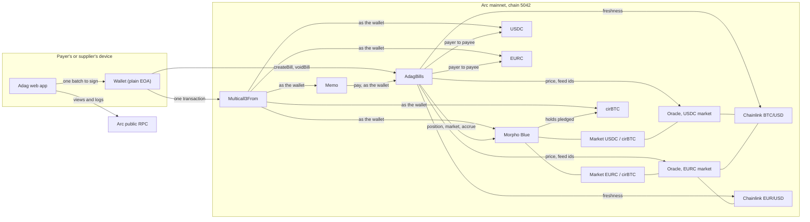
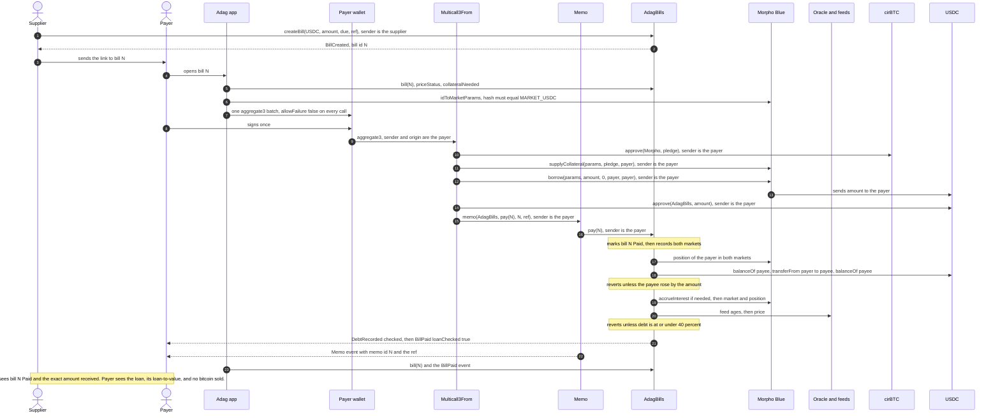
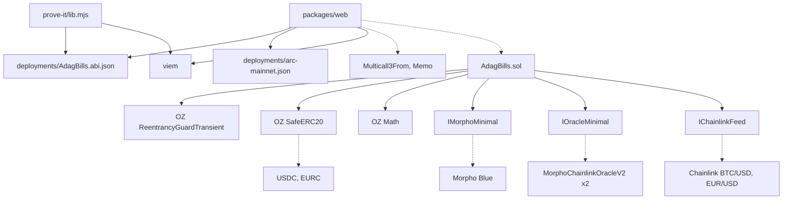

<p align="center">
  
</p>

<h1 align="center">Adag</h1>

<p align="center"><strong>Pay your bills with your bitcoin, without selling it.</strong></p>

<p align="center">Adag, from the Tamil அடகு, <em>adagu</em>, a pledge: the way families pledge gold for cash instead of selling it.</p>

<p align="center">
  <a href="{{LIVE_URL}}">Live app</a> ·
  <a href="{{LIVE_URL}}/docs">Docs</a> ·
  <a href="{{LIVE_URL}}/break">Try to break it</a> ·
  <a href="https://explorer.arc.io/address/0x6F2199e0A04e5e8ba67c89C467b6DF168b01137E">Contract on explorer.arc.io</a>
</p>

## Live deployment

| What | Where |
| --- | --- |
| AdagBills on Arc mainnet (chain `5042`) | [`0x6F2199e0A04e5e8ba67c89C467b6DF168b01137E`](https://explorer.arc.io/address/0x6F2199e0A04e5e8ba67c89C467b6DF168b01137E) |
| Source verification | Exact match on [Sourcify](https://repo.sourcify.dev/5042/0x6F2199e0A04e5e8ba67c89C467b6DF168b01137E) and on [explorer.arc.io](https://explorer.arc.io/address/0x6F2199e0A04e5e8ba67c89C467b6DF168b01137E?tab=contract) |
| Deploy transaction | [`0x758e4463...0a66e50`](https://explorer.arc.io/tx/0x758e4463ec738c675e4d9615aff67d9864359c7a30b3a77bd7b2689d30a66e50), block 22,727,688, solc 0.8.30, optimizer 200 runs, EVM prague |
| First real payment | Bill #1, 1.00 USDC, paid from a cirBTC-backed Morpho loan in one signature: [`0x69879...af2292`](https://explorer.arc.io/tx/0x6987964bddd7f8a8fe2a59d6de9baaa6ac37b8a720aae5900d8cb9af0eaf2292) |
| Web app | [{{LIVE_URL}}]({{LIVE_URL}}), with the docs at [/docs]({{LIVE_URL}}/docs) |

## Overview

Adag lets a company pay its suppliers in USDC or EURC from bitcoin it holds and does not sell. You sign once. In that one signature the bitcoin (as cirBTC) is pledged on Morpho, exactly the bill amount is borrowed against it, and the supplier is paid with the invoice number attached. A run of up to 10 supplier bills goes in the same one signature. The bitcoin stays pledged in your name, never sold, and you can take it back whenever you repay.

It is built first for businesses and crypto teams that hold bitcoin in their treasury and pay suppliers in dollars or euros, who today sell bitcoin or borrow and then pay each invoice by hand. Circle mints cirBTC for institutions, not individuals, so a company that already holds bitcoin through Circle is the closest fit. Individuals who hold cirBTC are just as welcome: one bill works the same way as ten.

Adag refuses any payment that would push your loan past 40% of the bitcoin's value. Morpho, the lending market underneath, only liquidates at 86%, so a loan at Adag's cap would need bitcoin to fall about 53.5% before Morpho could liquidate it (0.40 / 0.86, before interest). The landing page shows that price live.

Where the bitcoin is: cirBTC is Circle's wrapped bitcoin, backed 1:1 by bitcoin held by Circle International Bermuda, with public reserve addresses on [circle.com/cirbtc](https://www.circle.com/cirbtc). When pledged it sits in your own Morpho position and is not lent out. Adag never holds it.

It runs on Arc mainnet today. The contract is live, verified, and has already paid a real bill from a bitcoin-backed loan.

| | Selling bitcoin to pay | Borrowing on a lending app yourself | Adag |
| --- | --- | --- | --- |
| Your bitcoin is never sold | No | Yes | Yes |
| Signatures to pay one bill | Several, across services | Four or five | One |
| Signatures to pay ten bills | A sale, then one per bill | Three to borrow, then one per bill | One |
| Supplier sees the invoice number | Rarely | No | Yes, attached on Arc |
| Stops you borrowing too much | Not applicable | No, up to 86% | Yes, 40% cap in the contract |
| Proof the supplier was paid | A receipt you trust | Your own records | Checked on chain in the same call |

Under the hood it is one contract, AdagBills, and this web app. The contract is a public bill book: a supplier writes a bill, and anyone else can pay it exactly once. It has no owner, no admin key, no upgrade path and no pause switch, and it never holds tokens between calls. The app reads everything it shows from Arc; there is no database and no account to create.

## Features

### For a company paying suppliers

- **Pay a run of supplier bills in one signature.** Up to 10 bills, grouped by currency, each currency paid from the wallet's balance or from a loan against its cirBTC, in one batch that lands whole or not at all.
- **An invoice number on every payment.** Each bill carries the supplier's own reference, attached to its payment through Arc's Memo.
- **Each bill paid exactly once.** The contract refuses a second payment, so a retried run or a duplicate link cannot pay a supplier twice.
- **Paid status, live.** A bill's page turns Paid within seconds of the payment, for the payer and the supplier, with a link to the transaction.
- **Pay from bitcoin without selling it.** Pledge cirBTC, borrow exactly the bills, and pay, as one all-or-nothing batch signed once.
- **Or pay from a USDC or EURC balance**, in the same one signature, with no loan.
- **A hard cap on the loan.** The contract refuses any payment that pushes the loan past 40% of the bitcoin's value. The app proposes the pledge the contract itself computes, plus a 5% margin, and the landing page shows, live, the bitcoin price at which Morpho would liquidate a loan at the cap.
- **Pledged, never sold.** Your cirBTC stays pledged to Morpho in your own name. The wallet page shows each loan live and lets you add collateral or close the loan in full to take your cirBTC back.
- **Nothing to trust in the link.** From a link the app reads only the bill number. Who is paid, how much and in which currency all come from the contract.

### For suppliers

- **Write a bill in USDC or EURC** with your own reference (up to 140 bytes), payable to your wallet exactly once, and share its link.
- **Get paid in full or not at all.** A bill is marked paid only if your balance rose by the full amount inside the same call.
- **The invoice number travels with the money**, attached to the payment through Arc's Memo.
- **Cancel an open bill** at any time; a cancelled bill can never be paid.

### For anyone checking

- **Live numbers before any wallet connects.** The first screen reads Morpho's liquidity, the live borrow rate, the 40% cap, Morpho's 86% line and every bill paid through Adag straight from Arc. A read that fails shows "unavailable", never zero.
- **Try to break it.** One button runs 16 attacks against the live contract, simulated on current mainnet state, and shows what stops each one.
- **Everything is on the record.** Every bill, payment and loan is public on Arc and linked to its transaction on the explorer.

## Contracts on Arc mainnet

Every address below is fixed in the app when it is built; nothing read from the chain or a link can replace one.

| What | Address |
| --- | --- |
| AdagBills | [`0x6F2199e0A04e5e8ba67c89C467b6DF168b01137E`](https://explorer.arc.io/address/0x6F2199e0A04e5e8ba67c89C467b6DF168b01137E) |
| Multicall3From | [`0x522fAf9A91c41c443c66765030741e4AaCe147D0`](https://explorer.arc.io/address/0x522fAf9A91c41c443c66765030741e4AaCe147D0) |
| Memo | [`0x5294E9927c3306DcBaDb03fe70b92e01cCede505`](https://explorer.arc.io/address/0x5294E9927c3306DcBaDb03fe70b92e01cCede505) |
| CallFrom precompile (the app never calls it directly) | [`0x1800000000000000000000000000000000000003`](https://explorer.arc.io/address/0x1800000000000000000000000000000000000003) |
| Morpho Blue | [`0x34CD04070dD72b14E241112F6d83812Df5Af7fCD`](https://explorer.arc.io/address/0x34CD04070dD72b14E241112F6d83812Df5Af7fCD) |
| USDC, ERC-20 interface, 6 decimals | [`0x3600000000000000000000000000000000000000`](https://explorer.arc.io/address/0x3600000000000000000000000000000000000000) |
| EURC, 6 decimals | [`0xbEf5f6d51CB62b58e6A8f77868681825C6fe21c1`](https://explorer.arc.io/address/0xbEf5f6d51CB62b58e6A8f77868681825C6fe21c1) |
| cirBTC, 8 decimals | [`0x171A4217b86A807A64eB94757Db6849fb4bDbAA0`](https://explorer.arc.io/address/0x171A4217b86A807A64eB94757Db6849fb4bDbAA0) |
| Oracle, USDC market | [`0x2AA87fF48933Ce6aBA240BEE916Fc2e6Ec1e51Ab`](https://explorer.arc.io/address/0x2AA87fF48933Ce6aBA240BEE916Fc2e6Ec1e51Ab) |
| Oracle, EURC market | [`0x6945246777DfdF4744D957323857F797Ec19Ca1e`](https://explorer.arc.io/address/0x6945246777DfdF4744D957323857F797Ec19Ca1e) |
| Interest rate model, both markets | [`0xF02615d094Fc02fC031C35fe705e175aA4653f20`](https://explorer.arc.io/address/0xF02615d094Fc02fC031C35fe705e175aA4653f20) |
| Chainlink BTC/USD | [`0x7777547914e03BCbB04Ae034942765a0dbb26aE3`](https://explorer.arc.io/address/0x7777547914e03BCbB04Ae034942765a0dbb26aE3) |
| Chainlink EUR/USD | [`0xa4266689D107aF71c7dBE975cfB92aB40E7b4EFE`](https://explorer.arc.io/address/0xa4266689D107aF71c7dBE975cfB92aB40E7b4EFE) |

| Morpho market | Id | Liquidates at |
| --- | --- | --- |
| USDC lent against cirBTC | [`0xc2db905f174e5defcce01d321b09f15f78856a36a21b90cc7e1abbc29225815d`](https://app.morpho.org/arc/market/0xc2db905f174e5defcce01d321b09f15f78856a36a21b90cc7e1abbc29225815d) | 86% |
| EURC lent against cirBTC | [`0x6ea1ea96a1cc671615f3a3bdf51481c5b79e362a8b634396e680d1070137daf4`](https://app.morpho.org/arc/market/0x6ea1ea96a1cc671615f3a3bdf51481c5b79e362a8b634396e680d1070137daf4) | 86% |

A second, smaller USDC/cirBTC market exists on Arc with a different oracle. Adag never uses it: market details must hash to one of the two ids above before anything is signed.

## Architecture

The full interface the app is built from, with every read and write, is in [ARCHITECTURE.md](ARCHITECTURE.md).

### System overview



Multicall3From and Memo reach their targets through Arc's CallFrom precompile, which is why the wallet, not the batch contract, is the sender Morpho, the tokens and AdagBills see.

### One bitcoin-backed payment, end to end



### Contract and module dependencies



Solid arrows are code dependencies. Dotted arrows are calls to deployed contracts.

## The two-minute judge path

1. **Open [{{LIVE_URL}}]({{LIVE_URL}}).** Before you connect anything, the first screen shows live numbers read from Arc: the USDC Morpho has ready to lend, the live borrow rate, Adag's 40% cap next to Morpho's 86% line, and the total paid through Adag, with a link to that payment on the explorer.
2. **Open [/bill/1]({{LIVE_URL}}/bill/1).** A real bill: 1.00 USDC, reference `ADAG-PROOF-0001`, marked Paid, settled from a cirBTC-backed Morpho loan in one signature. Its transaction is [`0x6987...2292`](https://explorer.arc.io/tx/0x6987964bddd7f8a8fe2a59d6de9baaa6ac37b8a720aae5900d8cb9af0eaf2292) on explorer.arc.io.
3. **Open [/break]({{LIVE_URL}}/break) and press the one button.** It runs 16 real attacks against the live contract, simulated on current mainnet state, with nothing signed or sent. Every attack is refused for the reason the threat model names; the one payment that goes through, a cash payment after a simulated price drop, is allowed on purpose because it adds no debt.
4. **Skim [/docs]({{LIVE_URL}}/docs)**, especially [How it works]({{LIVE_URL}}/docs/how-it-works) and [Audit status]({{LIVE_URL}}/docs/security/audit-status).
5. **Run the proof yourself** (Node 20 or later, no keys, no `.env`):

```bash
git clone {{REPO_URL}} adag && cd adag
(cd packages/contracts/prove-it && npm ci)
node packages/contracts/prove-it/prove-it.mjs
```

Every step runs in `eth_simulateV1` from the latest real Arc block, so balances, the Morpho market and the price feed are live, and nothing is signed or sent. With no `.env`, it uses the public demo wallets from the first live run and says so. It exits 0 only if every check passes. This is the output from a fresh clone (your block, prices and bill number will differ):

```text
Adag prove-it: DRY RUN on live Arc mainnet state (chain 5042, block 22769069, 2026-09-25T23:56:23.000Z).
Every step runs in eth_simulateV1 on dRPC. Nothing is signed or sent.
Adag at 0x6F2199e0A04e5e8ba67c89C467b6DF168b01137E (from deployments/arc-mainnet.json).
No DEPLOYER_ADDRESS or PAYEE_ADDRESS in .env, so using the public demo wallets: payer 0x6e26Dd347b57ba591Ee34292A2d828CCC17A1fDE, payee 0xc95DE79125A9D7fCfE17f35C7Dbe0e88725Ad93B.

Starting state
  payer 0x6e26Dd347b57ba591Ee34292A2d828CCC17A1fDE: 4.898352 USDC, 0.00008840 cirBTC in wallet, 0.00003133 cirBTC pledged, loan 1.000001 USDC
  payee 0xc95DE79125A9D7fCfE17f35C7Dbe0e88725Ad93B: 1.045868 USDC, 0.00000000 cirBTC
  BTC price 83,808.46 USDC per cirBTC, updated 7.9 hours ago (fresh; Adag accepts new loans up to 26 hours)

Plan (dry run)
  -  no fee top-up: the payee already holds 1.045868 USDC
  1. payee writes a bill for 1.000000 USDC, due 2026-10-02, reference ADAG-PROOF-0001
  2. payer signs ONE batch through Multicall3From, every step all-or-nothing:
       approve 0.00002975 cirBTC to Morpho
       pledge 0.00002975 cirBTC in the cirBTC/USDC market (Adag asks for 0.00002833 cirBTC, plus a 5% margin)
       borrow 1.000000 USDC against it
       approve Adag for exactly 1.000000 USDC
       pay bill #2 through Memo, tagged ADAG-PROOF-0001

Running
  bill #2 written by the payee
  batch of 5 steps done in one signature

Receipt
  tx 1 create bill (payee)      gas   162,534   cost 0.003413 USDC
  tx 2 pledge, borrow, pay      gas   354,867   cost 0.007452 USDC
  BillPaid  bill #2, payer 0x6e26..1fDE, payee 0xc95D..d93B, 1.000000 USDC, loan checked true
  Memo      sender 0x6e26..1fDE, target Adag 0x6F21..137E, memo id 2, text "ADAG-PROOF-0001", memo index 503
  payee USDC      1.045868 USDC before, 2.045868 USDC after (+1.000000 USDC)
  payer cirBTC    0.00005865 cirBTC in wallet, 0.00006108 cirBTC pledged, bitcoin sold: 0.00000000 cirBTC
  payer USDC      4.898352 USDC before, 4.898352 USDC after (borrowed 1 and paid 1 out; gas is extra on a real run)
  payer loan      2.000001 USDC, loan-to-value 39.07% (Adag caps new loans at 40%, Morpho liquidates at 86%)

Gas: 517,401 in 2 transactions, 0.010865 USDC estimated at the current base fee plus 1 gwei (21 gwei)

Checks
  PASS  payee received exactly 1.000000 USDC
  PASS  BillPaid from Adag names this bill, payer, payee and amount
  PASS  Memo from the Memo contract: sender payer, target Adag, memo id = bill id
  PASS  bill is marked Paid by this payer
  PASS  bitcoin sold: 0 (wallet plus pledged is unchanged)

PROVEN (dry run): the payee was paid 1 USDC from a loan against the payer's bitcoin, in one signature, and no bitcoin was sold.
```

The same script with `--broadcast` sends it for real; that is how bill #1 was paid on 25 September 2026. `--broadcast` needs the demo wallets' keys in `.env`, and without them it stops before any network call.

## Quick start

### Run the app locally

Node 20 or later. No `.env` is needed: the app reads Arc's public RPC.

```bash
cd packages/web
npm ci
npm run dev
```

Open http://localhost:3000. A production build is `npm run build` then `npm run start`.

### Run the proof and the attack suite

The proof is step 5 of the judge path above. The attack suite needs the same one `npm ci` and nothing else:

```bash
node packages/contracts/prove-it/attack.mjs
```

It simulates each attack from the latest block against the live contract and the demo wallet's real Morpho loan, prints each attack, what should stop it and the decoded revert, and appends that table to `packages/contracts/deployments/attacks-<date>.md`. On a fresh clone every row passes, and it exits 0. The last lines of that run:

```text
| A9a | SIMULATED PRICE DROP (-25%, loan now 50.78%): pay a new bill from cash, no new debt | allowed: no new debt, so no check (a price drop never blocks a cash payment) | success, loanChecked false | PASS |
| A9b | SIMULATED PRICE DROP (-25%): borrow 0.010000 USDC more and pay the same bill | Adag: new debt, 40% check | MemoFailed(LtvAboveLimit(MARKET_USDC, 1010001, 787715)); bill Open | PASS |
| A10a | prove-it dry run when https://rpc.mainnet.arc.io reports chain 1 (fetch stubbed, no network) | prove-it: chain id must be 5042 before anything else | exit 1; STOPPED: https://rpc.mainnet.arc.io reports chain 1, not Arc mainnet 5042. | PASS |
| A10b | prove-it dry run when https://rpc.mainnet.arc.io reports 5042 but https://rpc.drpc.mainnet.arc.io reports chain 1 (fetch stubbed, no network) | prove-it: chain id must be 5042 before anything else | exit 1; STOPPED: https://rpc.drpc.mainnet.arc.io reports chain 1, not Arc mainnet 5042. | PASS |

All 18 checks behaved as the threat model says: every attack was refused, and the named residual (A4) behaved exactly as documented.
```

### Run the tests

The contract tests need [Arc Foundry](https://github.com/circlefin/arc-foundry) (`arc-forge`), Arc's build of Foundry. Upstream `forge` cannot run Arc's CallFrom precompile, so Memo and Multicall3From tests fail or lie under it. Install it and put `arc-forge` on your PATH. On Windows the scripts hand themselves to WSL Ubuntu and expect `arc-forge` in `~/.local/bin` there.

```bash
bash packages/contracts/install-deps.sh
bash packages/contracts/run-tests.sh
```

`install-deps.sh` fetches forge-std v1.16.2 and OpenZeppelin Contracts v5.6.1 at pinned tags. The tests run on a fork of Arc mainnet pinned to block 22,727,600, just before AdagBills was deployed, because some of them spend the demo wallets' real balances and the live proof has since used them. `FORK_BLOCK=N` or `--fork-block-number N` picks another block, and `FORK_BLOCK=latest` runs on the newest one.

## Reading Adag from your own code

```js
import { createPublicClient, http, parseAbi } from "viem";

const client = createPublicClient({ transport: http("https://rpc.mainnet.arc.io") });

const ADAG = "0x6F2199e0A04e5e8ba67c89C467b6DF168b01137E";
const abi = parseAbi([
  "function bill(uint256 id) view returns ((address payee, uint8 status, uint64 due, address currency, uint64 createdAt, uint256 amount, address payer, uint64 paidAt, bytes ref))",
]);

const bill = await client.readContract({ address: ADAG, abi, functionName: "bill", args: [1n] });
const STATUS = ["None", "Open", "Paid", "Void"];

console.log({
  status: STATUS[bill.status],
  payee: bill.payee,
  payer: bill.payer,
  amount: `${Number(bill.amount) / 1e6} (6 decimals)`,
  paidAt: new Date(Number(bill.paidAt) * 1000).toISOString(),
  ref: Buffer.from(bill.ref.slice(2), "hex").toString("utf8"),
});
```

```text
{
  status: 'Paid',
  payee: '0xc95DE79125A9D7fCfE17f35C7Dbe0e88725Ad93B',
  payer: '0x6e26Dd347b57ba591Ee34292A2d828CCC17A1fDE',
  amount: '1 (6 decimals)',
  paidAt: '2026-09-25T18:15:10.000Z',
  ref: 'ADAG-PROOF-0001'
}
```

The full ABI is [`packages/contracts/deployments/AdagBills.abi.json`](packages/contracts/deployments/AdagBills.abi.json). Amounts are integers in base units: 6 decimals for USDC and EURC, 8 for cirBTC.

Treat a bill as paid only from `bill(id).status` (`2` is Paid), or from a `BillPaid` event emitted by AdagBills' own address, tied to its transaction hash and log index. A `Memo` event on its own proves nothing: anyone can emit one with any bill number. Show the reference as plain text only, never as HTML or a link.

## Contract reference

AdagBills ([`packages/contracts/src/AdagBills.sol`](packages/contracts/src/AdagBills.sol)) is immutable and has no owner. It fixes Morpho, USDC, EURC, cirBTC, the two market ids, the 40% line (`MAX_LTV_WAD = 0.4e18`), the price windows (`BTC_USD_MAX_AGE = 26 hours`, `EUR_USD_MAX_AGE = 96 hours`), the reference cap (`MAX_REFERENCE_BYTES = 140`) and the page size (`MAX_PAGE = 100`) as public constants.

### Functions that change state

| Function | Who calls it | What it does | Reverts with |
| --- | --- | --- | --- |
| `createBill(address currency, uint256 amount, uint64 due, bytes ref) returns (uint256 id)` | A supplier, directly | Writes an Open bill payable to the caller. Ids start at 1. `due` is information only. Emits `BillCreated` | `ZeroAmount`, `ReferenceTooLong`, `UnsupportedCurrency`, `BadMarket` |
| `voidBill(uint256 id)` | The bill's supplier | Cancels an Open bill; it can never be paid. Emits `BillVoided` | `UnknownBill`, `BillNotOpen`, `NotPayee` |
| `pay(uint256 id)` | A payer, through Memo inside a Multicall3From batch | Marks the bill Paid before any external call, records the payer's position in both markets, moves exactly the amount from payer to supplier and checks the supplier's balance rose by it, then runs the 40% check if the position became riskier. Emits `DebtRecorded` for each changed market, then `BillPaid` | `UnknownBill`, `BillNotOpen`, `SelfPayment`, `PayeeNotCredited`, `BadMarket`, `BadFeed`, `StalePrice`, `ZeroPrice`, `LtvAboveLimit`, and the token's own revert |

### Views

| Function | What it returns | Reverts with |
| --- | --- | --- |
| `bill(uint256 id)` | The full record: `(payee, status, due, currency, createdAt, amount, payer, paidAt, ref)`. An unknown id returns status `None` | |
| `billCount()` | Bills ever written, which is also the highest id | |
| `billsOfPayee(address payee, uint256 offset, uint256 limit)` | A supplier's bill ids, oldest first, and the total | `PageTooLarge` above 100 |
| `paymentsOfPayer(address payer, uint256 offset, uint256 limit)` | Bill ids a payer has paid, oldest first, and the total | `PageTooLarge` above 100 |
| `seenPosition(address payer, bytes32 marketId)` | The borrow shares and collateral Adag recorded at the payer's last payment | |
| `loanToValue(address user, bytes32 marketId)` | Debt over collateral value, WAD scaled, rounded up. A preview: no interest accrual, no freshness check | `BadMarket` |
| `collateralNeeded(address user, bytes32 marketId, uint256 extraBorrow)` | Extra cirBTC, in satoshis, so current debt plus `extraBorrow` sits at or under 40%. 0 if none is needed | `BadMarket`, `ZeroPrice` |
| `priceStatus(bytes32 marketId)` | Whether new debt would pass the freshness check now, and each feed's update time | `BadMarket`, `BadFeed` |

### Events

| Event | Meaning |
| --- | --- |
| `BillCreated(uint256 indexed id, address indexed payee, address indexed currency, uint256 amount, uint64 due, bytes ref)` | A bill was written |
| `BillVoided(uint256 indexed id, address indexed payee)` | A bill was cancelled |
| `BillPaid(uint256 indexed id, address indexed payer, address indexed payee, address currency, uint256 amount, bool loanChecked)` | The proof of payment. `loanChecked` is true if the 40% check ran |
| `DebtRecorded(address indexed payer, bytes32 indexed marketId, uint256 borrowShares, uint256 collateral, bool checked)` | Adag stored a new position for the payer in one market |

### Errors

| Error | Meaning |
| --- | --- |
| `ZeroAmount()` | The bill amount is 0 |
| `ReferenceTooLong(uint256 length)` | The reference is over 140 bytes, counted in bytes |
| `UnsupportedCurrency(address currency)` | Only USDC and EURC |
| `UnknownBill(uint256 id)` | No bill with this number |
| `BillNotOpen(uint256 id, uint8 status)` | Already paid or cancelled |
| `NotPayee(address caller)` | Only the supplier who wrote a bill can cancel it |
| `SelfPayment()` | A supplier cannot pay its own bill |
| `PayeeNotCredited(uint256 rise, uint256 amount)` | The supplier's balance did not rise by the amount, so nothing happened |
| `BadMarket(bytes32 marketId)` | Morpho reports the market differently from what Adag expects |
| `BadFeed(address oracle)` | The market's price oracle names no feed |
| `StalePrice(address feed, uint256 updatedAt)` | The price feed is too old for new debt; paying from a balance still works |
| `ZeroPrice()` | The oracle reads 0 |
| `LtvAboveLimit(bytes32 marketId, uint256 borrowed, uint256 maxBorrow)` | This payment would leave the loan above 40% |
| `PageTooLarge(uint256 limit)` | A page asked for more than 100 ids |

Through a batch, these arrive wrapped in Memo's `MemoFailed(bytes returnData)`; unwrap it before showing a reason.

## Tests

73 tests in 6 suites, all passing on a fork of Arc mainnet pinned to block 22,727,600, from `bash packages/contracts/run-tests.sh` in a fresh clone:

```text
Fork: https://rpc.mainnet.arc.io at block 22727600
Ran 5 tests for test/AdagFuzz.t.sol:AdagFuzzTest
[PASS] testFuzz_collateralNeeded_isTheSmallestThatPasses(uint256,uint256) (runs: 1000, μ: 1105172, ~: 1144568)
[PASS] testFuzz_createBill_storesOrRejects(uint256,uint256,uint256,bool,uint64) (runs: 1000, μ: 204607, ~: 236631)
[PASS] testFuzz_line_matchesIndependentMaths(uint256) (runs: 1000, μ: 650891, ~: 673006)
[PASS] testFuzz_loanToValue_matchesIndependentMaths(uint256,bool) (runs: 1000, μ: 268795, ~: 244533)
[PASS] testFuzz_priceDrop_cashAlwaysPasses_newDebtOnlyWithinLine(uint256,uint256) (runs: 1000, μ: 1184813, ~: 1245350)
Suite result: ok. 5 passed; 0 failed; 0 skipped; finished in 1.01s (4.66s CPU time)
Ran 7 tests for test/AdagFuzz.t.sol:AdagGasScenarios
Suite result: ok. 7 passed; 0 failed; 0 skipped; finished in 9.10s (37.21ms CPU time)
Ran 5 tests for test/Harness.t.sol:HarnessTest
Suite result: ok. 5 passed; 0 failed; 0 skipped; finished in 10.56s (8.48ms CPU time)
Ran 25 tests for test/AdagLoanRule.t.sol:AdagLoanRuleTest
Suite result: ok. 25 passed; 0 failed; 0 skipped; finished in 14.74s (118.09ms CPU time)
Ran 24 tests for test/AdagBills.t.sol:AdagBillsTest
Suite result: ok. 24 passed; 0 failed; 0 skipped; finished in 14.74s (62.41ms CPU time)
Ran 7 tests for test/invariant/AdagInvariant.t.sol:AdagInvariantTest
[PASS] invariant_I1_adagHoldsNothing() (runs: 256, calls: 16384, reverts: 0)
[PASS] invariant_I2_statusOnlyMovesForward() (runs: 256, calls: 16384, reverts: 0)
[PASS] invariant_I3_payeesCreditedExactly() (runs: 256, calls: 16384, reverts: 0)
[PASS] invariant_I4_recordedPositionMatchesAfterPay() (runs: 256, calls: 16384, reverts: 0)
[PASS] invariant_I5_newDebtWithinLine() (runs: 256, calls: 16384, reverts: 0)
[PASS] invariant_I6_idsAreOneToN() (runs: 256, calls: 16384, reverts: 0)
[PASS] invariant_I7_uncheckedDebtIsDominated() (runs: 256, calls: 16384, reverts: 0)
Suite result: ok. 7 passed; 0 failed; 0 skipped; finished in 14.74s (72.97s CPU time)
Ran 6 test suites in 15.22s (64.90s CPU time): 73 tests passed, 0 failed, 0 skipped (73 total tests)
```

- **Bills** (24): writing, cancelling and paying through Memo; every refusal (second payment, self-payment, cancelled or unknown bills, fake currencies, zero amounts, the 140-byte cap); pagination; price freshness at 26 and 96 hours.
- **The loan rule** (25): the 40% boundary; the reused-shares bypass refused; borrowing past the line and paying a tiny bill in either currency; stale BTC and EUR prices; a zero price or a missing feed; a price drop blocking only new debt; repaying and closing a loan after an hour and after 30 days; three bills in one signature; the named residual.
- **Fuzzing** (5 tests at 1,000 runs each): `collateralNeeded` is the smallest pledge that passes, and the 40% line and loan-to-value match independent maths.
- **Invariants** (7, each at 256 runs of 64 calls): among them, Adag never holds tokens, a bill's status only moves forward, suppliers are credited exactly, and I7: every position with debt that Adag accepted without a check is at least as safe as the last one a check approved.
- **Arc itself** (5): Multicall3From really acts as the wallet, Memo tags the transfer, nested batches work, a contract caller is refused, and both markets resolve, so the rest of the suite tests what really runs on Arc.
- **Gas scenarios** (7): the isolated, cold measurements in the next section.

## Gas

Measured on a fork of Arc mainnet, each figure a whole cold transaction as a wallet would send it ([GAS.md](packages/contracts/analysis/GAS.md)). Arc charges fees in USDC; at the network's 20 gwei floor, every 1,000,000 gas costs 0.02 USDC, so the most expensive action here costs under 2 cents.

| Action | Gas | USDC at 20 gwei |
| --- | ---: | ---: |
| Write a bill, short reference, first bill ever | 196,662 | 0.0039 |
| Write a bill, short reference, later bill | 179,442 | 0.0036 |
| Write a bill, 140-byte reference | 310,684 | 0.0062 |
| Cancel a bill | 28,497 | 0.0006 |
| Pay from a USDC balance | 186,799 | 0.0037 |
| Pay from bitcoin: approve, pledge, borrow, approve, pay | 396,047 | 0.0079 |
| Three bills in one signature, two markets | 825,707 | 0.0165 |
| Close a loan in full | 154,599 | 0.0031 |

Paying from bitcoin costs about 209,000 gas more than paying from a balance: that is Morpho's own pledge and borrow plus Adag's 40% check. On mainnet, the live proof's bill cost 196,734 gas (0.004131 USDC) and its bitcoin-backed payment 406,167 gas (0.008530 USDC).

## Project structure

```text
.
├── ARCHITECTURE.md              every address, read and write the app makes, and the rules it obeys
├── LICENSE
├── docs/
│   ├── assets/adag-mark.svg
│   └── security/threat-model.md the threat model, written before the contract
└── packages/
    ├── contracts/
    │   ├── src/                 AdagBills.sol and three minimal interfaces
    │   ├── test/                fork tests, fuzzing, invariants, gas scenarios
    │   ├── script/              the deploy script
    │   ├── deployments/         address, ABI, verification input, live proof and attack records
    │   ├── analysis/            static analysis and gas reports
    │   ├── prove-it/            the live proof and the attack suite
    │   ├── install-deps.sh      forge-std and OpenZeppelin at pinned tags
    │   ├── run-tests.sh         the fork tests under Arc Foundry
    │   ├── deploy.sh
    │   └── verify.sh
    └── web/
        ├── src/app/             the landing page, /pay, /bill, /app, /break, /docs and the API routes
        ├── src/components/      hero, landing, pledge, app, break and docs components
        ├── src/lib/             chain reads, wallet, payment builders, attack runner
        ├── content/docs/        the /docs pages in MDX
        └── public/images/
```

## Tech stack

| Layer | What | Version |
| --- | --- | --- |
| Contract | Solidity, optimizer 200 runs, EVM prague | 0.8.30 |
| Contract libraries | OpenZeppelin Contracts (SafeERC20, Math, ReentrancyGuardTransient) | 5.6.1 |
| Build and tests | Arc Foundry (`arc-forge`), forge-std | forge 1.7.1-dev, forge-std 1.16.2 |
| Static analysis | slither, solhint, arc-forge lint | slither 0.11.6, solhint 6.2.4 |
| Chain access | viem | 2.56.9 |
| Wallet | wagmi with TanStack Query | 3.7.7, 5.103.2 |
| App | Next.js App Router, React, TypeScript | 16.3.6, 19.3.0, 5.9.3 |
| Styling and motion | Tailwind CSS, GSAP, Lenis, Motion | 4.3.3, 3.15.0, 1.3.26, 13.4.4 |
| Docs | Fumadocs, Mermaid | 16.15.14, 12.0.0 |
| On Arc | Morpho Blue, Chainlink price feeds, Memo, Multicall3From | as deployed |

## Security

Self-audited, not audited by a firm. The evidence is published so you can check each step:

- The [threat model](docs/security/threat-model.md), written before any contract code, with its section C as the definition of done, including six app-layer invariants (C25 to C30) added at the final review.
- [Attack results](packages/contracts/deployments/attacks-2026-09-25.md): 18 attacks against the live contract, every one behaving as the threat model says, including the reused-shares bypass that a separate review found before deploy and that the contract now refuses.
- [Static analysis](packages/contracts/analysis/STATIC-ANALYSIS.md): slither, solhint and arc-forge lint, with no real bugs and a verdict for every finding.
- 73 passing tests, including fuzzing and invariants.
- Three separate reviews by a reviewer who did not write the code: the second found a contract bypass before deploy, and the third found three app-layer issues, fixed before release. The full account is on the [audit status]({{LIVE_URL}}/docs/security/audit-status) page.

The design goal is that if the page, a link or the RPC is wrong, the worst case is a transaction that reverts, never one that loses money. The contract cannot take a payer's bitcoin: the only token movement it can cause is the exact bill amount, from the payer, to that bill's supplier, inside the call that marks the bill paid.

Adag deliberately does not defend against:

- who a supplier really is (a bill from someone pretending to be your landlord is a valid bill);
- Morpho, the oracles or the token contracts being wrong, paused, blocklisting or upgraded (it fails closed on their reverts and zeros);
- a compromised wallet, browser or operating system, or a compromised page build or hosting;
- watching a loan after payment (it checks the 40% line once, at payment, and Morpho liquidates at 86%);
- a payer going above 40% by using Morpho directly;
- privacy (every bill, amount, reference and payer is public on chain);
- front-running (its flows have no slippage to extract), availability of the public RPC or hosting, how other explorers display Memo data, and due dates (shown, not enforced).

## What's next

- **Payroll from a bitcoin treasury.** Many bills, one signature, on a schedule, so a company that holds bitcoin can pay its people and suppliers without selling it.
- **A guard for falling prices.** When bitcoin falls, repay part of the loan from dollar savings automatically, before Morpho's line gets close.
- **An API for wallets and neobanks**, so they can offer "pay with your bitcoin" to their own users, with Adag's 40% line underneath.

## Licence

MIT. See [LICENSE](LICENSE).

## Acknowledgments

- **Circle and Arc**, for the chain Adag is built on: Memo for the invoice reference, Multicall3From and the CallFrom precompile for one-signature batches that act as the wallet, and USDC as the gas token.
- **Morpho Blue**, for the USDC and EURC markets lent against cirBTC, and the adaptive rate model.
- **Chainlink**, for the BTC/USD and EUR/USD price feeds behind the markets' oracles.
- **OpenZeppelin**, for SafeERC20, Math and ReentrancyGuardTransient.
- **Arc Foundry**, for running Arc's precompile in tests.
- **Fumadocs**, for the docs inside the app.
