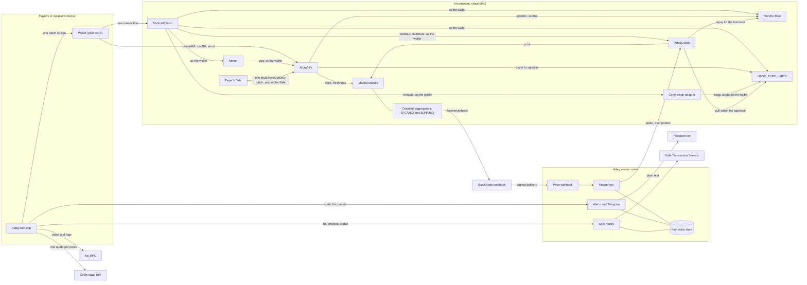
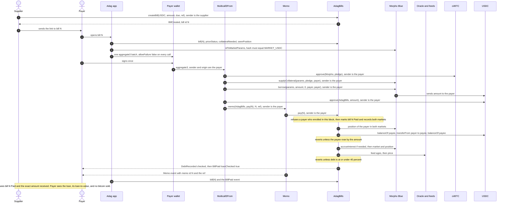
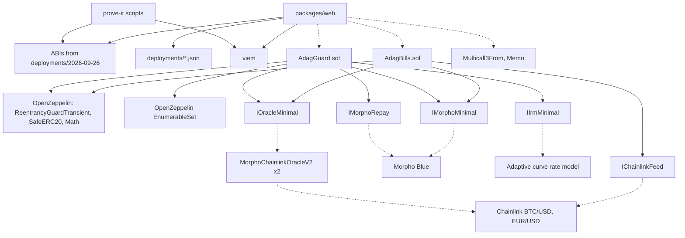

When you pay a bill from bitcoin, your wallet signs one transaction. That transaction runs five calls in order, all of them as you. If any one of them fails, the whole transaction is undone and nothing happened.

A company paying a run of supplier bills signs the same way: up to 10 bills in one transaction, grouped by currency, each paid through its own Memo call with the supplier's invoice number, and the contract's 40% check still applied to every payment that adds debt. A company that pays from its Safe gets the same bills in one Safe transaction instead: see [Safe payments](/docs/safe).

## The one-signature batch

These are the five calls, in the order the app builds them. `P` is the pledge, `A` the bill amount, `C` the bill's currency (USDC or EURC), `N` the bill number and `R` the invoice reference.

1. `cirBTC.approve(Morpho, P)`: let Morpho take exactly the pledge.
2. `Morpho.supplyCollateral(params, P, payer, 0x)`: pledge the bitcoin. It stays pledged in your name, never sold.
3. `Morpho.borrow(params, A, 0, payer, payer)`: borrow exactly the bill, to your own wallet.
4. `C.approve(AdagBills, A)`: let Adag move exactly that amount.
5. `Memo.memo(AdagBills, payData(N), memoId(N), R)`: pay bill `N` through Memo, with the reference attached.

A few rules hold for every batch the app builds:

- Every call targets an address fixed when the app was built: AdagBills, AdagGuard, Morpho, Memo, Multicall3From or one of the three tokens. Nothing in a link or an RPC answer can change a target, a receiver or an amount. The one exception is a payment from a loan in the other currency, which adds a single call to Circle's swap adapter, held to its own rules: see [Paying from a loan in the other currency](#paying-from-a-loan-in-the-other-currency).
- Approvals go only to the contract that uses them, for exactly the amount that batch uses.
- Every call is marked "must succeed". There is no partial success.
- Market details fetched from the chain must hash to the fixed market id before they go into a call, so a lying RPC cannot swap in a different market.

If your existing pledge already covers the loan, steps 1 and 2 are left out. Paying from a USDC or EURC balance is just steps 4 and 5. Several bills can go in one signature, grouped by currency, up to 10 bills per batch. A bill can also be paid from a loan in the other currency, converted by Circle in the same signature: see [Paying from a loan in the other currency](#paying-from-a-loan-in-the-other-currency).

The pledge the app proposes is what the contract's own `collateralNeeded` view asks for, plus a 5% margin to absorb a price move before the block lands. If the margin is not enough, the transaction reverts with `LtvAboveLimit`. It never over-borrows.

## Memo and Multicall3From

Two small contracts that ship with Arc make the single signature possible.

**Multicall3From** (`0x522fAf9A91c41c443c66765030741e4AaCe147D0`) takes a list of calls and runs them through Arc's CallFrom precompile. The effect is that every call reaches its target with your wallet as the sender. Morpho sees you pledging and borrowing for yourself, so it needs no extra permission. The tokens see you approving. AdagBills sees you paying.

**Memo** (`0x5294E9927c3306DcBaDb03fe70b92e01cCede505`) wraps the payment call and emits a `Memo` event carrying the bill number and your reference, so the supplier's invoice number travels with the money.

A Memo event on its own proves nothing, because anyone can emit one with any bill number. Adag's app treats a bill as paid only when that bill's own AdagBills says so in storage, or when there is a `BillPaid` event from that contract's address, tied to a transaction hash and log index.

## Why this only works on Arc

- **Batches that act as your wallet.** CallFrom lets one signed transaction run several calls as the signer, from a plain wallet. On most chains you would need a smart-contract wallet, or several signatures, and the lending market would see a batching contract as the borrower instead of you.
- **A native memo.** Attaching an invoice reference to a payment is a first-class Arc feature, not a custom log format.
- **Fees in USDC.** Gas is paid in USDC, the same currency as the bill. A bitcoin-backed payment costs about 0.008 USDC in fees.
- **Morpho Blue with cirBTC markets.** Arc has live Morpho markets lending USDC and EURC against cirBTC, with Chainlink price feeds. Adag is fixed to those two markets.

## The new-debt rule

The 40% check lives inside AdagBills' `pay` function, so it applies however the transaction was built: by this app, by a Safe, by a script, or by hand.

On every payment, for both markets, Adag compares your live Morpho position with the last one it recorded for you. The check runs whenever you have debt and your position has become riskier by your own action since then: more borrow shares, or less pledged collateral. When it runs:

- Debt is your borrow shares converted to assets, rounded up, after interest is brought up to date in the same transaction.
- Collateral value is your pledged cirBTC times the oracle price, rounded down.
- The payment reverts unless debt is at or under 40% of that value, read from live Morpho and oracle state. Nothing you pass in can stand in for it.
- A new loan also needs a fresh price: the BTC/USD feed no older than 26 hours, and EUR/USD no older than 96 hours for the euro market.

A payment from your balance that adds no new debt is never blocked by a price drop. The rule only guards new borrowing.

<Callout type="warn" title="The one named gap">
  The check runs at the moment Adag's step executes. Someone who hand-builds a batch can borrow more after that step, in the same transaction. That puts only their own position at risk, and it lasts until their next Adag payment: the extra debt was never recorded, so it counts as new debt then, and that payment is refused while the loan sits above 40%.
</Callout>

The first version of this rule compared borrow shares only. A separate review found it could be skipped: pay once, close the loan outside Adag, then re-open it with exactly the recorded share count against far less bitcoin. The rule now records both shares and collateral, and a randomised invariant test that includes that exact attack fails within 5 calls if the old rule is put back. See [Audit status](/docs/security/audit-status).

## Recording an existing loan

A wallet that Adag has never seen has a recorded position of zero, so any loan it already holds counts as new debt at its first payment. If that loan is above 40%, the payment is refused, even one paid from cash.

`enrol()` fixes that. It takes no arguments and records the caller's own Morpho position in both markets, exactly as Morpho reports it in that block. No money moves, and nobody can record a position for someone else. From then on Adag judges only what you borrow after the record: a cash payment that adds no debt goes through, and borrowing more, or taking collateral away, is checked against the 40% line as before.

Recording and paying in the same block is refused (`EnrolledThisBlock`), so new debt cannot be borrowed, recorded and spent in one batch. The promise is that a payment through Adag is never the action that takes a position above 40%.

<Callout type="warn" title="The named residual of recording">
  Someone who borrows outside Adag, records it in one block and pays from cash in the next has their earlier borrowing forgiven by the record. That is what recording means, and it affects only their own position. The attack suite runs exactly this every time and shows it behaving as documented.
</Callout>

This was proven on 26 September 2026 on a real borrower's wallet at 70.26%, simulated on live state because only that borrower could sign: a cash payment was refused before recording; after recording, borrowing more in the paying batch was refused, and the same bill paid from cash went through. A Safe records its loan in a Safe transaction of its own: see [Safe payments](/docs/safe#an-existing-loan).

## Paying from a loan in the other currency

A bill in USDC can be paid from a EURC loan, and a bill in EURC from a USDC loan. Adag offers it as a choice next to the loan in the bill's own currency. It is one signature: you pledge cirBTC, borrow the other currency, Circle converts it to the bill's currency, and the bill is paid.

### Why it exists

Morpho's dollar market is often fully lent while its euro market has cash. On 6 October 2026 the USDC market had about 5 USDC free to borrow, and the EURC market about 89,750 EURC. A dollar bill of more than a few dollars could not be paid from a dollar loan that day, while the euro market could have lent the equivalent of about $100,000. Adag shows both figures live on the pay screens, read from Morpho, so you can see which loan can carry the bill.

### What happens in the one signature

These are the calls for a USDC bill paid from a EURC loan, in the order the app builds them. `X` is the amount of EURC borrowed and sold, `P` the pledge in the EURC market, `A` the bill amount and `N` the bill number.

1. `cirBTC.approve(Morpho, P)` and `Morpho.supplyCollateral(...)`: pledge cirBTC in the EURC market. Bitcoin already pledged in the USDC market cannot back a euro loan, so this comes from your wallet.
2. `Morpho.borrow(params, X, 0, payer, payer)`: borrow `X` of EURC to your own wallet.
3. `EURC.approve(adapter, X)`: let Circle's swap adapter take exactly `X`, and nothing more.
4. `adapter.execute(plan)`: Circle's signed plan sells `X` of EURC for USDC and sends the USDC to your wallet.
5. `USDC.transfer(payer, floor)`: the balance check, right after the swap.
6. `USDC.approve(AdagBills, A)` and `Memo.memo(AdagBills, pay(N), ...)`: pay the bill, as in a normal payment.
7. `EURC.approve(adapter, 0)`: take the approval back.

If any call fails, the whole transaction is undone and nothing happened.

The conversion is Circle's App Kit Swap, run through Circle's own swap adapter on Arc at `0x7FB8c7260b63934d8da38aF902f87ae6e284a845`. Circle writes the plan and signs it, and the plan is good for 10 minutes. Adag does not run it on trust. The app decodes the plan, checks that it pulls exactly `X` of the loan currency from your wallet, sends everything it buys to your wallet and promises at least the bill amount, then writes the call again itself and refuses unless the bytes are identical. Nothing Circle writes in words reaches the screen.

The balance check in step 5 is what keeps a bad swap from costing you more than gas. It is a transfer of the floor amount from your wallet to your own wallet, which reverts unless you really hold that much. The floor is your balance of the bill's currency before the batch, plus the bill amount. If the swap did not deliver, the transfer fails and the whole batch is undone: nothing borrowed, nothing paid. Without it, Adag's `pay` would take the missing dollars from your own balance, because it takes a bill's amount from your whole balance. In the test on Arc, a stand-in for Circle's adapter kept the borrowed euros and returned nothing. With the check, the batch reverted and the supplier got nothing. Without it, the same batch paid the bill from the payer's own USDC.

<Callout type="warn" title="The named slack of the balance check">
  When the bill is in USDC, Arc takes the network fee from the same balance that the check reads, up front, at the price it will actually charge. The floor is lowered by the gas limit at the highest price the transaction allows, which is a little more. A swap that comes up short by that difference still passes: at most the gas limit of 4 million times the highest fee minus the fee charged. With today's fees that is about 0.08 USDC, and your own money fills it. For a EURC bill the slack is zero.
</Callout>

### What it costs

- **Circle's fee** is 0.02%, already inside its quote.
- **The price the pools pay** adds the rest. Fee and price together lost 0.06% to 0.09% in measurements on 6 October, which is about 6 to 9 cents per 100 USDC for normal sizes, and a little more for larger ones.
- **A buffer.** The swap is priced in advance and must return at least the bill, so you borrow a little more than the bill is worth, never more than 1.5% over. Whatever the swap does not need stays in your wallet as spare USDC (about 0.37 USDC on a 100 USDC bill with a 0.4% buffer), and the loan stays the full amount borrowed.
- **Gas** is about 1.1 million gas for a 100 USDC bill, which is about 0.02 USDC at Arc's 20 gwei floor, against about 0.008 USDC for a bitcoin payment in the bill's own currency. Circle's route for a bill of 1 to 3 USDC measured more, 1.9 to 2.4 million gas.
- **Interest** on the euro loan, at Morpho's rate for that market.

### The currency risk

A euro loan is a euro debt. The amount you owe is fixed in euros, and its dollar cost moves with EUR/USD.

A 100 USDC bill paid from a EURC loan borrows about 88.8 EURC when EUR/USD is 1.127, which was the price on 6 October 2026. Then:

- At 1.127, the debt costs about $100.09.
- If EUR/USD rises 5%, the same debt costs $105.09, which is $5.00 more.
- If EUR/USD falls 5%, it costs $95.09, which is $5.00 less.

So each 1% move changes the dollar cost of a $100 bill by about $1.

The loan-to-value moves too. A loan taken at 38.1% reaches about 40.0% if the euro rises 5%, and falls to about 36.2% if the euro falls 5%. The 40% line is checked only when new debt is added, so a rising euro never blocks anything, but it does leave the loan closer to Morpho's 86% liquidation line. With a euro loan, liquidation depends on BTC/USD and EUR/USD together. From 38.1%, bitcoin would have to fall about 56%, measured in euros. [AdagGuard](/docs/loan-guard) can watch the loan afterwards, but it repays only from the loan's own currency already in your wallet, so after a conversion it needs EURC there.

### The limits

- **One conversion per payment.** A basket can hold one group paid this way, never two, and never two converting in opposite directions.
- **Not for Safes.** Circle's quote lasts 10 minutes and a Safe's signatures take longer, so a Safe pays in the bill's own currency.
- **Very large conversions are refused on gas.** A converting payment is signed with a fixed gas ceiling of 4 million. If the simulation shows it would need more, with 25% headroom, the app says so and sends nothing. Pay a smaller amount, or in the bill's own currency.
- **A fresh euro price.** The euro feed must be no older than 96 hours, and it pauses over weekends. While it is stale, a dollar bill cannot be paid from a euro loan. Paying in the bill's own currency still works.
- **Circle must answer.** The app asks Circle when you press pay, and never when a page loads. If Circle says it found no route or is rate limiting, the app repeats the identical request up to twice, after 1.5 and then 3 seconds, and nothing you see or sign changes. If Circle is still busy, finds no route or does not answer, the app shows one of its own sentences and sends nothing. Circle sees your wallet address, the amounts and the timing of each request.
- **A double-check before you sign.** Before your wallet is asked, the app runs the whole payment on a node that traces every token transfer, and refuses unless each transfer out of your wallet is one it expects. If no node can do that, or none answers in time, the app says "We could not double-check this conversion just now. Nothing was sent. Try again in a minute." and never asks your wallet to sign.
- **Nothing left open.** Before offering a conversion, Adag reads what Circle's adapter may already do with your wallet. An earlier approval to it for any of the three tokens, or an authorisation of it on Morpho, blocks the conversion until you clear it, which takes one signature. After the batch the approval reads zero.
- **A quote that is too old is not used.** A plan with less than two minutes left is refused, and a plan is spent the moment a signature is asked for.

### Closing such a loan with the other currency

A loan taken this way can be closed with the other currency. If you owe EURC from a converted payment and hold USDC instead, Adag sells USDC to Circle for at least the amount needed to close, runs the same balance check on EURC, repays the loan by shares, takes your cirBTC back only after that full repayment, and sets the adapter's approval back to 0, all in one signature. The same rules and limits apply. Converting out and converting back costs about 0.1% in fees and prices, before any move in EUR/USD.

### The proof

`node packages/web/scripts/check-fx.mjs`, run from the repository root, prints ten checks, F1 to F10, against live Arc mainnet state. Every step is a simulation on a real block, and nothing is signed or sent.

- F1 and F2: the balance check passes when met and reverts when short, including the slack on USDC.
- F3 and F4: code inside the batch tries to make Multicall3From and Memo move your cirBTC as you, and your cirBTC does not move.
- F5 and F6: a 100 USDC bill paid from a EURC loan with a real Circle plan, then the same batch with a stand-in that keeps the borrowed euros, which reverts.
- F7: a EURC loan closed with USDC through a real plan.
- F8: a 3 EURC bill paid from a USDC loan. It reports SKIP when the USDC market has too little cash to lend.
- F9 and F10: the bill and the close again, built by the app's own code.

It does not cover a real transaction, MEV, a Safe, or what a wallet shows you. The rules behind it are C65 to C75 in the [threat model](/docs/security/threat-model).

## After the payment: the loan guard

Adag checks the 40% line at the moment you pay. After that, [AdagGuard](/docs/loan-guard) can watch the loan: you set a trigger and a target and approve an amount of the loan's currency, and once the loan passes the trigger anyone may call `protect`, which repays only what brings the loan back to your target, from your own wallet. Adag's keeper calls it when Chainlink's price updates, and [Telegram alerts](/docs/alerts) tell you when a loan gets close. Before a bitcoin payment that takes your loan to or past your own trigger, the pay screen says how much the guard will then repay. A payment from your balance keeps aside what the guard is about to repay and says so under the button, and if the guard cannot be read, the pay screens do not pay.

## Diagrams

### System overview

Multicall3From and Memo reach their targets through Arc's CallFrom precompile, which is why the wallet, not the batch contract, is the sender Morpho, the tokens, AdagBills and AdagGuard see. The keeper's wallet holds gas only and can send one thing: `protect`.

### One bitcoin-backed payment, end to end

### Contract and module dependencies

Solid arrows are code dependencies. Dotted arrows are calls to deployed contracts.
