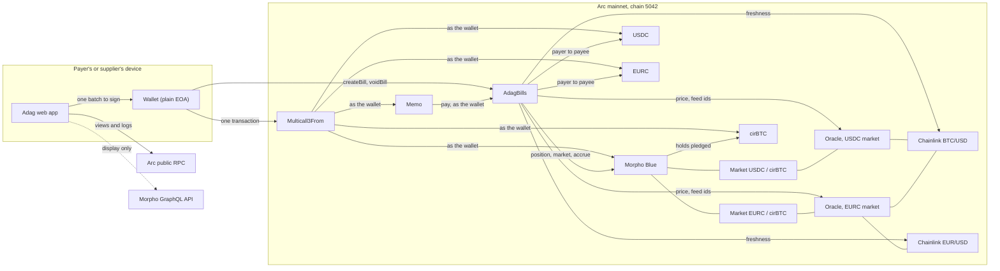
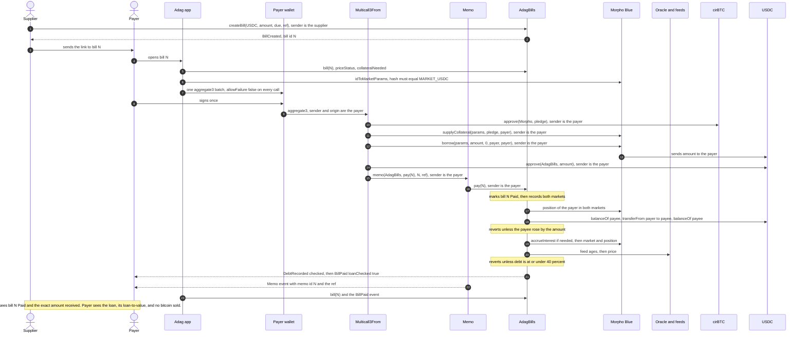
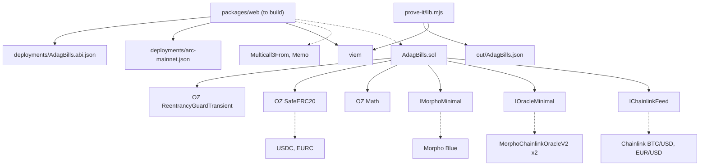

When you pay a bill from bitcoin, your wallet signs one transaction. That transaction runs five calls in order, all of them as you. If any one of them fails, the whole transaction is undone and nothing happened.

## The one-signature batch

These are the five calls, in the order the app builds them. `P` is the pledge, `A` the bill amount, `C` the bill's currency (USDC or EURC), `N` the bill number and `R` the invoice reference.

1. `cirBTC.approve(Morpho, P)`: let Morpho take exactly the pledge.
2. `Morpho.supplyCollateral(params, P, payer, 0x)`: pledge the bitcoin. It stays in your name.
3. `Morpho.borrow(params, A, 0, payer, payer)`: borrow exactly the bill, to your own wallet.
4. `C.approve(AdagBills, A)`: let Adag move exactly that amount.
5. `Memo.memo(AdagBills, payData(N), memoId(N), R)`: pay bill `N` through Memo, with the reference attached.

A few rules hold for every batch the app builds:

- Every call targets an address fixed when the app was built: AdagBills, Morpho, Memo, Multicall3From or one of the three tokens. Nothing in a link or an RPC answer can change a target, a receiver or an amount.
- Approvals go only to Morpho or AdagBills, for exactly the amount that batch uses.
- Every call is marked "must succeed". There is no partial success.
- Market details fetched from the chain must hash to the fixed market id before they go into a call, so a lying RPC cannot swap in a different market.

If your existing pledge already covers the loan, steps 1 and 2 are left out. Paying from a USDC or EURC balance is just steps 4 and 5. Several bills can go in one signature, grouped by currency, up to 10 bills per batch.

The pledge the app proposes is what the contract's own `collateralNeeded` view asks for, plus a 5% margin to absorb a price move before the block lands. If the margin is not enough, the transaction reverts with `LtvAboveLimit`. It never over-borrows.

## Memo and Multicall3From

Two small contracts that ship with Arc make the single signature possible.

**Multicall3From** (`0x522fAf9A91c41c443c66765030741e4AaCe147D0`) takes a list of calls and runs them through Arc's CallFrom precompile. The effect is that every call reaches its target with your wallet as the sender. Morpho sees you pledging and borrowing for yourself, so it needs no extra permission. The tokens see you approving. AdagBills sees you paying.

**Memo** (`0x5294E9927c3306DcBaDb03fe70b92e01cCede505`) wraps the payment call and emits a `Memo` event carrying the bill number and your reference, so the supplier's invoice number travels with the money.

A Memo event on its own proves nothing, because anyone can emit one with any bill number. Adag's app treats a bill as paid only when AdagBills' own storage says so, or when there is a `BillPaid` event from AdagBills' address, tied to a transaction hash and log index.

## Why this only works on Arc

- **Batches that act as your wallet.** CallFrom lets one signed transaction run several calls as the signer, from a plain wallet. On most chains you would need a smart-contract wallet, or several signatures, and the lending market would see a batching contract as the borrower instead of you.
- **A native memo.** Attaching an invoice reference to a payment is a first-class Arc feature, not a custom log format.
- **Fees in USDC.** Gas is paid in USDC, the same currency as the bill. A bitcoin-backed payment costs about 0.008 USDC in fees.
- **Morpho Blue with cirBTC markets.** Arc has live Morpho markets lending USDC and EURC against cirBTC, with Chainlink price feeds. Adag is fixed to those two markets.

## The new-debt rule

The 40% check lives inside AdagBills' `pay` function, so it applies however the transaction was built: by this app, by a script, or by hand.

On every payment, for both markets, Adag compares your live Morpho position with the last one it recorded for you. The check runs whenever you have debt and your position has become riskier by your own action since then: more borrow shares, or less pledged collateral. When it runs:

- Debt is your borrow shares converted to assets, rounded up, after interest is brought up to date in the same transaction.
- Collateral value is your pledged cirBTC times the oracle price, rounded down.
- The payment reverts unless debt is at or under 40% of that value, read from live Morpho and oracle state. Nothing you pass in can stand in for it.
- A new loan also needs a fresh price: the BTC/USD feed no older than 26 hours, and EUR/USD no older than 96 hours for the euro market.

A payment from your balance that adds no new debt is never blocked by a price drop. The rule only guards new borrowing.

<Callout type="warn" title="The one named gap">
  The check runs at the moment Adag's step executes. Someone who hand-builds a batch can borrow more after that step, in the same transaction. That puts only their own position at risk, and it lasts until their next Adag payment: the extra debt was never recorded, so it counts as new debt then, and that payment is refused while the loan sits above 40%.
</Callout>

The first version of this rule compared borrow shares only. A separate review found it could be skipped: pay once, close the loan outside Adag, then re-open it with exactly the recorded share count against far less bitcoin. The rule now records both shares and collateral, and a randomised invariant test that includes that exact attack fails within 5 calls if the old rule is put back. See [Audit status](/docs/security/audit-status).

## Diagrams

### System overview

Multicall3From and Memo reach their targets through Arc's CallFrom precompile, which is why the wallet, not the batch contract, is the sender Morpho, the tokens and AdagBills see.

### One bitcoin-backed payment, end to end

### Contract and module dependencies

Solid arrows are code dependencies. Dotted arrows are calls to deployed contracts.
